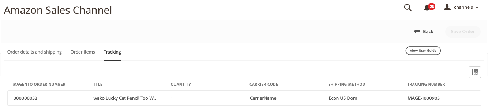

# Amazon 주문 세부 사항

{width="600" zoomable="yes"}

## Amazon 주문 세부 사항 보기

1. 클릭 **[!UICONTROL View Store]** 가게 카드에서요.

1. 다음에서 _[!UICONTROL Recent Orders]_섹션에서 주문 번호를 클릭합니다.

   다음 _[!UICONTROL Amazon Order Details]_페이지가 열립니다.

>[!NOTE]
>
>에서 주문 가져오기를 활성화한 경우 [주문 설정](./order-settings.md) 그리고 순서는 입니다. [Amazon(FBA)에서 이행](./fulfilled-by.md)를 클릭하면 주문 세부 사항의 일부 필드에 대한 더미 데이터가 표시될 수 있습니다. Amazon은 FBA 주문에 대해 다음 데이터를 전송하지 않습니다.
>
> - `AddressType`
> - `AddressLine1`
> - `AddressLine2`
> - `AddressLine3`
> - `BuyerName`
> - `Phone`
> - `PurchaseOrderNumber`
> - `RecipientName`
> - `CustomizedURL`
> - `GiftMessageText`

### 주문 및 배송 세부 사항 탭

다음 _[!UICONTROL Order and Shipping Details]_탭에는 Amazon에서 받은 자세한 주문 정보가 표시됩니다.

>[!IMPORTANT]
>
>Amazon은 Amazon 판매 채널로 가져올 수 없는 비표준 주소 정보를 승인하므로 일부 주문에 대해 주/국가 코드가 올바르게 업데이트되지 않습니다. 주소 오류를 수정하려면 다음 필드를 주문 세부 정보에서 편집할 수 있습니다.
>
>- `Shipping address 1`
>- `Shipping address 2`
>- `Shipping address 3`
>- `Shipping city`
>- `Shipping region`
>- `Shipping postal code`
>- `Shipping country`
>
>다음을 잊지 말고 클릭합니다. **순서 저장** 편집한 후.

{width="600" zoomable="yes"}

### 주문 항목 탭

다음 _[!UICONTROL Order Items]_탭에는 Amazon에서 받은 대로 Amazon 주문과 연결된 모든 항목이 표시됩니다.

{width="600" zoomable="yes"}

### 추적 탭

다음 _[!UICONTROL Tracking]_탭에는 Amazon 주문과 연결된 추적 정보가 표시됩니다.

{width="600" zoomable="yes"}
