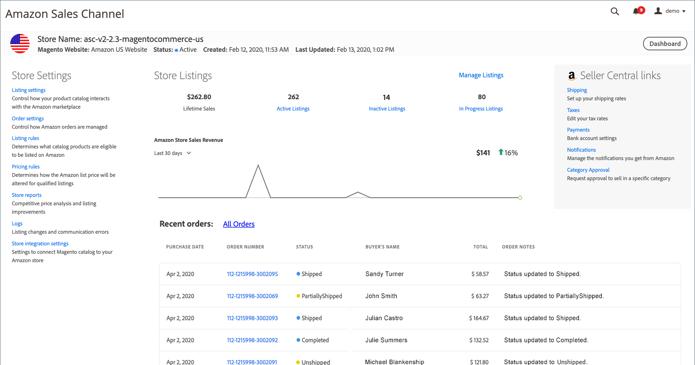

# Amazon 스토어 대시보드

다음에서 _[!UICONTROL Amazon Stores]_Amazon sales channel 홈 페이지에서 다음을 클릭 할 수 있습니다.**[!UICONTROL View Store]**스토어 카드를 클릭하여 스토어 대시보드를 엽니다.

스토어 대시보드는 각 Amazon 스토어에 대한 활동을 볼 수 있는 기본 위치입니다. (으)로 [!DNL Amazon Seller] 스토어 데이터 보기를 통해 추가된 스토어와 통합된 주문 및 판매 추적입니다. 대시보드에서 매출을 보고, 트렌드를 추적하고, 목록에 대한 판매 데이터를 검토할 수 있습니다. 목록 및 판매는 활성, 비활성, 진행 중 등 목록 유형별로 추가 그룹화 및 추적됩니다.

에 액세스할 수도 있습니다. [스토어 설정](./ob-store-review.md), [목록 관리](./managing-product-listings.md), 판매 데이터 및 최근 주문 정보를 볼 수 있습니다.

{width="600" zoomable="yes"}

스토어 대시보드의 헤더에는 스토어 카드에 표시된 것과 동일한 기본 스토어 정보가 표시됩니다.

- _[!UICONTROL Store Name]_
- _[!UICONTROL Magento Website]_
- _[!UICONTROL Status]_
- _[!UICONTROL Created]_
- _[!UICONTROL Last Updated]_

스토어 대시보드에는 스토어 데이터 및 설정 또는 추가 정보에 대한 링크도 포함됩니다.

- [**[!UICONTROL Store Settings]**](./ob-store-review.md) - 스토어 설정 및 보고서에 액세스합니다.

   - [**[!UICONTROL Listing settings]**](./listing-settings.md) - 제품 카탈로그와 [!DNL Amazon Marketplace].

   - [**[!UICONTROL Order settings]**](./order-settings.md) - Amazon 주문 관리 방법을 제어합니다.

   - [**[!UICONTROL Listing rules]**](./listing-rules.md) - Amazon에 나열할 수 있는 카탈로그 제품을 정의합니다.

   - [**[!UICONTROL Pricing rules]**](./pricing-products.md) - 적격 목록에 대해 Amazon 정가가 변경되는 방법을 정의합니다.

   - [**[!UICONTROL Store reports]**](./amazon-logs-reports.md) - [경쟁 제품 가격 분석](./competitive-price-analysis.md) 및 [목록 개선 사항](./listing-improvements.md).

   - [**[!UICONTROL Logs]**](./amazon-logs-reports.md) - [변경 내용 나열](./listing-changes-log.md) 및 [통신 오류](./communication-errors-log.md).

   - [**[!UICONTROL Store integration settings]**](./store-integration-settings.md) - 에서 이메일 및 Amazon 판매 채널 스토어 이름 설정을 검토합니다. [!DNL Commerce] 관리자.

- **[!UICONTROL Store Listings]** - 지난 7일 또는 30일 동안의 스토어 판매에 대한 그래픽 표시를 라이프타임 판매 데이터와 함께 표시합니다.

   이 섹션에는 다음에 대한 목록 카운트 또한 표시됩니다. [활성 목록](./active-listings.md), [비활성 목록](./inactive-listings.md), 진행 중인 목록 및 해당 목록에 대한 링크 포함 _[!UICONTROL Product Listings]_페이지를 가리키도록 업데이트하는 중입니다. 다음을 클릭할 수도 있습니다.**[!UICONTROL Manage Listings]**을(를) 열려면_[!UICONTROL Product Listings]_ 페이지를 가리키도록 업데이트하는 중입니다. 다음을 참조하십시오 [Amazon 목록 관리](./managing-product-listings.md).

- **[!UICONTROL Recent Orders]** - 가장 최근 Amazon 주문에 대한 정보를 표시합니다. 나열된 정보는 Amazon에서 받은 정보를 기반으로 합니다. 이 테이블은 다음으로 업데이트되지 않습니다. [!DNL Commerce] 주문 정보, 다음과 같은 경우에도 [주문 가져오기](./order-settings.md) 이(가) 활성화되었습니다. 모든 Amazon 주문을 보려면 **모든 주문**.

   다음을 참조하십시오 [Amazon 주문 보기](./amazon-orders-all.md) 열 설명을 보려면 다음을 참조하십시오 [주문 관리](./managing-orders.md) 추가 정보.

- **[!UICONTROL Seller Central links]** - 중요 링크를 제공합니다. [!DNL Amazon Seller Central] 정보.
