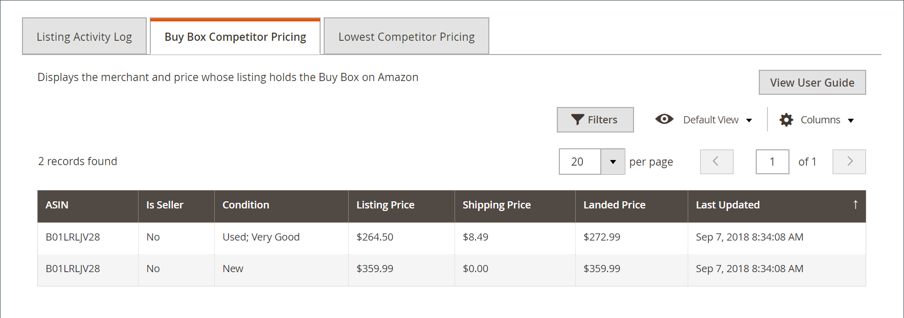

# Amazon 목록에 대한 경쟁업체 가격 [!DNL Buy Box]개

[!DNL Buy Box]은(는) Amazon에서 제공하는 FBA/Prime 배송, 가용성 및 판매자 성과와 같은 다른 요인과 함께 일반적으로 가장 좋은 가격으로 나열된 제품을 보유한 판매자에게 부여합니다.

_[!UICONTROL Product Listing Details]_페이지의_[!UICONTROL Buy Box Competitor Pricing]_ 탭에는 경쟁업체의 [[!DNL Buy Box]](./buy-box-competitor-pricing.md) 목록 가격, 배송 가격 및 랜딩 가격이 포함되어 있습니다. 이 정보를 사용하여 Amazon에서 경쟁업체의 가격 포지셔닝을 파악할 수 있습니다.

[지능형 가격 조정 규칙](./intelligent-repricing-rules.md)은(는) [!DNL Amazon Buy Box] 가격에 따라 가격을 조정하도록 구성할 수 있습니다.

{width="600" zoomable="yes"}

## [!DNL Buy Box] 경쟁업체 가격 세부 정보 액세스

1. 스토어 대시보드에서 **[!UICONTROL Manage Listings]**&#x200B;을(를) 클릭합니다.

   [_[!UICONTROL Product Listing]_](./managing-product-listings.md) 페이지가 열립니다.

1. 목록 상태 탭에서 목록에 대한 제품 목록 이름을 클릭합니다.

   _[!UICONTROL Product Listing Details]_페이지가 열립니다.

1. **[!UICONTROL Buy Box Competitor Pricing]** 탭을 클릭합니다.

   Amazon에서 [[!DNL Buy Box]](./buy-box-competitor-pricing.md) 목록을 보유한 판매자와 가격을 표시합니다.

| 열 | 설명 |
|-----------------------------|----------------------------------------------------------------------------------------------------------------------------------------------------------------------------------------------------------------------------------------------------------------------------------------------------------------------------------------------------------------------------------------|
| [!UICONTROL ASIN] | 항목을 식별하는 10개의 문자 및/또는 숫자로 구성된 고유 블록입니다.  책의 경우 ASIN은 ISBN 번호와 동일하지만 다른 모든 제품의 경우 항목을 카탈로그에 업로드하면 새 ASIN이 만들어집니다. 제품 세부 사항 페이지에서 항목의 ASIN을 항목과 관련된 추가 세부 사항(예: 크기, 페이지 수 또는 디스크 수)과 함께 찾을 수 있습니다. |
| [!UICONTROL Is Seller] | 판매자가 목록에 대한 Buy Box 위치를 획득했는지 보여 줍니다. |
| [!UICONTROL Condition] | 제품의 [조건](./product-listing-condition.md). |
| [!UICONTROL Listing Price] | Amazon 목록에 사용된 가격. |
| [!UICONTROL Shipping Price] | 제품 배송 비용. |
| [!UICONTROL Landed Price] | 제품의 목록 가격과 배송 가격을 더한 값입니다. |
| [!UICONTROL Last Updated] | Buy Box 가격을 마지막으로 업데이트한 날짜입니다. |
