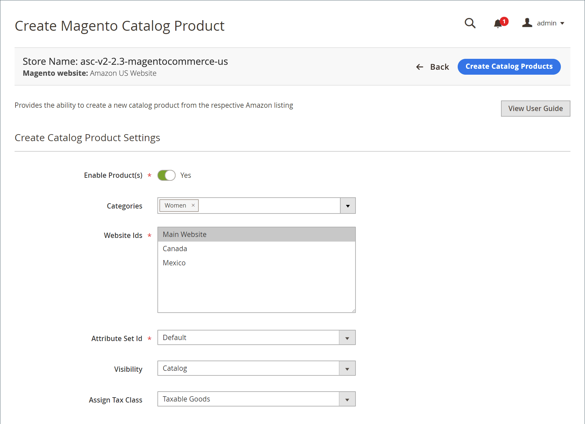

# 제품 만들기 및 할당

_[!UICONTROL New Third Party]_탭을 볼 때 [!DNL Commerce] 카탈로그 제품을 기존 Amazon 목록에 일치시킬 수 있습니다. 이 일치에는 두 가지 옵션이 있습니다. 목록을 기존 카탈로그 제품에 지정하거나 목록의 정보를 사용하여 카탈로그 제품을 만들 수 있습니다. 이러한 옵션은 Amazon 목록이 [!DNL Commerce] 카탈로그와 자동으로 일치하지 않을 때 유용합니다.

Amazon 판매 채널의 전체 기능을 사용하려면 제품을 Amazon 목록에 일치(또는 할당)해야 합니다.

Amazon 목록에서 카탈로그 제품을 만드는 경우:

- **ASIN**&#x200B;은 [!DNL Commerce] SKU가 됩니다
- **제품 목록 이름**&#x200B;은 카탈로그 목록 이름이 됩니다
- **가격** 및 **수량**&#x200B;은 Amazon 목록에서 가져옵니다

필요한 나머지 설정은 만드는 동안 선택한 [!DNL Commerce] 제품 설정에 의해 결정됩니다.

만들고 일치하면 목록이 _[!UICONTROL New Third Party]_탭에서 제거되고_[!UICONTROL Active]_ 탭에 나타납니다.

## Amazon 목록에 단일 카탈로그 제품 할당

1. [_[!UICONTROL New Third Party]_](./new-third-party-listings.md) 탭에서 제품 목록을 봅니다.

1. 목록에서 할당할 목록을 찾고 _[!UICONTROL Action]_열에서&#x200B;**[!UICONTROL Select]**을 클릭한 다음&#x200B;**[!UICONTROL Assign Catalog Product]**를 클릭합니다.

   이 작업을 수행하면 _[!UICONTROL Assign Magento Catalog Product]_페이지가 열립니다.

1. [작업 공간 컨트롤](./workspace-controls.md)을 사용하여 목록을 찾아보거나 필터링하고 목록에 일치하는 적절한 카탈로그 제품을 찾습니다.

1. 목록에 올바른 제품이 나타나면 _[!UICONTROL Action]_열에서&#x200B;**[!UICONTROL Assign Catalog Product]**을 클릭합니다.

이제 제품 및 목록이 일치합니다. 이제 Amazon 판매 채널은 제품 및 목록 데이터를 Amazon과 공유하고 목록 및 정보(목록 가격, 배송가격, 재고/수량, 주문 정보 및 상태 등)를 관리할 수 있습니다.

## Amazon 목록 정보를 사용하여 단일 카탈로그 제품 만들기

1. [_[!UICONTROL New Third Party]_](./new-third-party-listings.md) 탭에서 제품 목록을 봅니다.

1. [!DNL Commerce] 카탈로그에서 만들려는 목록을 찾고 _[!UICONTROL Action]_열에서&#x200B;**[!UICONTROL Select]**를 클릭한 다음&#x200B;**[!UICONTROL Create New Catalog Product]**를 클릭합니다.

   이 작업을 수행하면 _[!UICONTROL Create Magento Catalog Product]_페이지가 열립니다.

1. 제품에 대한 카탈로그 설정을 완료합니다.

   - **[!UICONTROL Enable Product(s)]** 을 `Yes` 또는 `No`(필수)로 전환합니다.

      |예|제품을 [!DNL Commerce] 상점 판매용으로 사용할 수 있도록 선택합니다.|
|아니요|제품이 [!DNL Commerce] 상점 판매에서 부적합하도록 선택합니다.|

   - **[!UICONTROL Categories]**&#x200B;에 대해 제품에 대한 카테고리를 할당합니다(선택 사항).

      제품 카테고리를 선택하려면 아래쪽 화살표를 클릭하고 카테고리 확인란을 선택합니다. 완료되면 **[!UICONTROL Done]** 을 클릭합니다.

   - **[!UICONTROL Website Ids]**&#x200B;에 연결할 웹 사이트(storefront)를 선택합니다.

      이 목록의 옵션은 [!DNL Commerce] [구성](https://docs.magento.com/user-guide/stores/websites-stores-views.html){target=&quot;_blank&quot;} 설정 내용에 따라 다릅니다.

   - **[!UICONTROL Attribute Set Id]**(필수)에 대해 옵션을 선택합니다.

      `Default` 는 기본 선택 항목입니다. 이 목록의 옵션은 구성한 [!DNL Commerce] [특성 세트](https://docs.magento.com/user-guide/stores/attribute-sets.html){target=&quot;_blank&quot;}에 따라 다릅니다.

   - **[!UICONTROL Visibility]**&#x200B;에 대해 새 제품에 대한 옵션을 선택합니다.

      |**[!UICONTROL Not Visible Individually]** (기본값)|이 제품은 다른 제품의 변형으로 사용할 수 있지만 상점 목록에 포함되지 않습니다.|
|**[!UICONTROL Catalog]**|제품이 카탈로그 목록에 나타납니다.|
|**[!UICONTROL Search]**|제품을 검색 작업에 사용할 수 있습니다.|
|**[!UICONTROL Catalog and Search]**|제품이 카탈로그 목록에 포함되어 있으며 검색 작업에 사용할 수 있습니다.|

   - **[!UICONTROL Assign Tax Class]**&#x200B;에 대해 제품에 대한 옵션을 선택합니다.

      이 목록에 표시되는 옵션은 구성한 [세금 클래스](https://docs.magento.com/user-guide/tax/tax-class.html){target=&quot;_blank&quot;}에 따라 다릅니다.

   - 완료되면 **[!UICONTROL Create Catalog Products]** 을 클릭합니다.

카탈로그 제품은 [!DNL Commerce] 카탈로그에서 만들어져서 생성된 Amazon 목록에 할당됩니다. 이제 목록이 기존 Amazon 목록과 일치하면 목록이 _[!UICONTROL New Third Party]_탭에서 제거되고_[!UICONTROL Active]_ 탭에 표시됩니다.

## Amazon 목록 정보를 사용하여 여러 카탈로그 제품 만들기

1. [_[!UICONTROL New Third Party]_](./new-third-party-listings.md) 탭에서 제품 목록을 봅니다.

1. 카탈로그 제품을 만들 목록을 선택합니다.

   왼쪽 열에서 개별 확인란을 선택하거나 왼쪽 상단 열의 아래쪽 화살표를 클릭하고 **[!UICONTROL Select All]** 또는 **[!UICONTROL Select All on this Page]**&#x200B;을 선택할 수 있습니다.

1. _[!UICONTROL Actions]_아래에서&#x200B;**[!UICONTROL Create New Catalog Product(s)]**를 클릭합니다.

1. 확인 메시지를 수락하고 _[!UICONTROL Create Magento Catalog Product]_페이지를 열려면&#x200B;**[!UICONTROL OK]**를 클릭합니다.

1. 제품에 대한 카탈로그 설정을 완료합니다.

   >[!NOTE]
   >선택한 여러 목록에 대한 카탈로그 제품을 만들 때 입력한 제품 설정이 모든 목록에 적용됩니다.

   - **[!UICONTROL Enable Product(s)]** 을 `Yes` 또는 `No`(필수)로 전환합니다.

      |예|제품을 [!DNL Commerce] 상점 판매용으로 사용할 수 있도록 선택합니다.|
|아니요|제품이 [!DNL Commerce] 상점 판매에서 부적합하도록 선택합니다.|

   - **[!UICONTROL Categories]**&#x200B;에 대해 제품에 대한 카테고리를 할당합니다(선택 사항).

      제품 카테고리를 선택하려면 아래쪽 화살표를 클릭하고 카테고리 확인란을 선택합니다. 완료되면 **완료**&#x200B;를 클릭합니다.

   - **[!UICONTROL Website Ids]**&#x200B;에 연결할 웹 사이트(storefront)를 선택합니다.

      이 목록의 옵션은 [!DNL Commerce] [구성](https://docs.magento.com/user-guide/stores/websites-stores-views.html){target=&quot;_blank&quot;} 설정 내용에 따라 다릅니다.

   - **[!UICONTROL Attribute Set Id]**(필수)에 대해 옵션을 선택합니다.

      `Default` 는 기본 선택 항목입니다. 이 목록의 옵션은 구성한 [!DNL Commerce] [특성 세트](https://docs.magento.com/user-guide/stores/attribute-sets.html){target=&quot;_blank&quot;}에 따라 다릅니다.

   - **[!UICONTROL Visibility]**&#x200B;에 대해 새 제품에 대한 옵션을 선택합니다.

      |**[!UICONTROL Not Visible Individually]** (기본값)|이 제품은 다른 제품의 변형으로 사용할 수 있지만 상점 목록에 포함되지 않습니다.|
|**[!UICONTROL Catalog]**|제품이 카탈로그 목록에 나타납니다.|
|**[!UICONTROL Search]**|제품을 검색 작업에 사용할 수 있습니다.|
|**[!UICONTROL Catalog and Search]**|제품이 카탈로그 목록에 포함되어 있으며 검색 작업에 사용할 수 있습니다.|

   - **[!UICONTROL Assign Tax Class]**&#x200B;에 대해 제품에 대한 옵션을 선택합니다.

      이 목록에 표시되는 옵션은 구성한 [세금 클래스](https://docs.magento.com/user-guide/tax/tax-class.html){target=&quot;_blank&quot;}에 따라 다릅니다.

   - 완료되면 **[!UICONTROL Create Catalog Products]** 을 클릭합니다.

카탈로그 제품은 [!DNL Commerce] 카탈로그에서 만들어져서 생성된 Amazon 목록에 할당됩니다. 이제 목록이 각 Amazon 목록과 일치하므로 목록이 [_[!UICONTROL New Third Party]_](./new-third-party-listings.md) 탭에서 제거되고 [_[!UICONTROL Active]_](./active-listings.md) 탭에 표시됩니다.

| 필드 | 설명 |
|--- |--- |
| [!UICONTROL Enable Product(s)] | (필수) 활성화된 경우 제품이 [!DNL Commerce] 스토어에 표시됩니다. 비활성화하면 [!DNL Commerce] 스토어에 제품이 표시되지 않습니다. |
| [!UICONTROL Categories] | 새 제품의 카테고리 이름을 입력하거나 아래쪽 화살표를 클릭하여 선택 사항을 선택하여 카테고리를 선택할 수 있습니다. 옵션은 [카테고리](https://docs.magento.com/user-guide/catalog/category-create.html){target=&quot;_blank&quot;} 구성에 따라 다릅니다. |
| [!UICONTROL Website Ids] | (필수) 제품을 연결할 웹 사이트(storefront)를 선택합니다. 옵션은 [!DNL Commerce] [저장소 구성](https://docs.magento.com/user-guide/stores/websites-stores-views.html){target=&quot;_blank&quot;} 설정에 따라 다릅니다 |
| 속성 세트 Id | 속성 세트를 선택합니다. 옵션은 구성된 [!DNL Commerce] [특성 세트](https://docs.magento.com/user-guide/stores/attribute-sets.html){target=&quot;_blank&quot;}에 따라 다릅니다. |
| [!UICONTROL Visibility] | 옵션:<ul><li>**[!UICONTROL Not Visible Individually]** - 제품이 상점 앞에  [!DNL Commerce] 표시되지 않습니다(변형 제품에 가장 일반적임).</li><li>**[!UICONTROL Catalog]** - 웹 사이트 내에서 연결된 카테고리를 통해 제품에 액세스할 수 있습니다.</li><li>**검색**  - 검색 도구를 통해서만 제품을 찾을 수 있습니다.</li><li>**[!UICONTROL Catalog and Search]** - 카테고리 구조와 검색 도구를 통해 제품에 액세스할 수 있습니다.</li></ul> |
| [!UICONTROL Assign Tax Class] | 신규 제품에 세금 분류를 지정합니다. 옵션은 구성된 [세금 클래스](https://docs.magento.com/user-guide/tax/tax-class.html){target=&quot;_blank&quot;}에 따라 다릅니다. |
