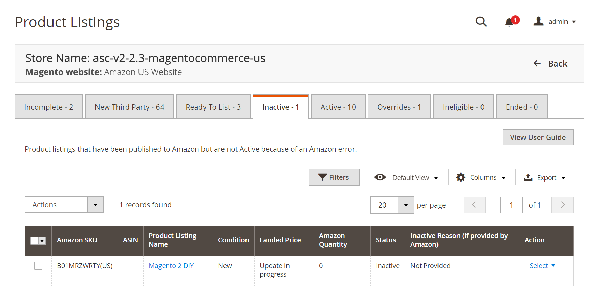

# 비활성 목록

_[!UICONTROL Inactive]_탭에는 Amazon에 게시되었지만 [!DNL Amazon Marketplace]에서 활성화되지 않은 제품이 표시됩니다. 몇 가지 다른 이유로 목록이 비활성 상태일 수 있습니다. 예를 들어 해당 특정 브랜드를 나열할 수 없는 경우가 있습니다. 비활성 목록은 Amazon의 목록 표준 및 [!DNL Amazon Seller Central] 계정 권한에 의해 결정됩니다.

_[!UICONTROL Actions]_아래:

- **[!UICONTROL End Listing(s) on Amazon]**: 선택한 모든 목록을  [!DNL Amazon Marketplace]에서 제거하려면 선택합니다. [Amazon 목록 종료](./end-listings-manually.md)를 참조하십시오.

- **[!UICONTROL Edit Listing Overrides]**: 목록의 무시 설정을 변경하려면 선택합니다. [Overrides](./overrides.md) 또는 [Edit 또는 remove a](./creating-editing-overrides.md#edit-override-single-listing)를 참조하십시오.

_[!UICONTROL Action]_열의&#x200B;**[!UICONTROL Select]**아래:

- **[!UICONTROL View Details]**: Listing Activity  [Log](./product-listing-details.md#listing-activity-log),  [Competitor Pricing](./product-listing-details.md#buy-box-competitor-pricing) 및  [Lowered Competitor Pricing](./product-listing-details.md#lowest-competitor-pricing)을 포함하여 목록 세부 사항을 표시하도록 선택합니다. 이 작업은 보기 전용입니다. 목록 세부 사항에서는 변경할 수 없습니다. [세부 정보 보기](./product-listing-details.md)를 참조하십시오.

- **[!UICONTROL Create Override]**: 무시를 만들고 이 목록에 적용하도록 선택합니다. [재정의 만들기](./creating-editing-overrides.md)를 참조하십시오.

- **[!UICONTROL Edit Assigned ASIN]**: 카탈로그 제품에 할당된 ASIN을 수정하도록 선택합니다. 이 작업은 카탈로그의 제품이 잘못된 ASIN과 일치한 경우 사용됩니다. [할당된 ASIN 편집](./edit-assigned-asin.md)을 참조하십시오.

- **[!UICONTROL Create Alias Seller SKU]**: 동일한 카탈로그 제품에서 Amazon 목록을 만드는 데 사용할 수 있는 별칭 SKU(Stock Keeping Unit)를 만들도록 선택합니다. [별칭 판매자 SKU 만들기](./create-alias-seller-sku.md)를 참조하십시오.

- **[!UICONTROL Switch to Fulfilled by Amazon/Merchant]**: 주문과 연관된 이행 방법을 변경하도록 선택합니다. [설정 ](./fulfilled-by.md#configure-fulfilled-by-settings)에 의해 수행되는 구성 을 참조하십시오.

- **[!UICONTROL End Listing]**: 목록에서 목록을 제거하도록 선택합니다  [!DNL Amazon Marketplace]. [Amazon 목록 종료](./end-listings-manually.md)를 참조하십시오.

>[!NOTE]
>
>진행 중인 목록이 있는 경우 목록 수를 나타내는 메시지가 탭 위에 표시됩니다.

Amazon 판매 채널 홈 페이지는 표시되는 데이터를 사용자 지정할 수 있는 몇 가지 일반적인 [작업 공간 컨트롤](./workspace-controls.md)을 공유합니다.

| 열 | 설명 |
|--- |--- |
| [!UICONTROL Amazon Seller SKU] | 제품, 옵션, 가격 및 제조업체를 식별하기 위해 Amazon이 제품에 할당한 SKU(Stock Keeping Unit)입니다. |
| [!UICONTROL ASIN] | 항목을 식별하는 10자 및/또는 숫자로 된 고유한 블록입니다.  ASIN은 Amazon 표준 식별 번호를 의미합니다. ASIN은 항목을 식별하는 10자 및/또는 숫자로 이루어진 고유한 블록입니다. 장부의 경우 ASIN은 ISBN 번호와 동일하지만 다른 모든 제품의 경우 항목이 카탈로그에 업로드되면 새 ASIN이 생성됩니다. 항목에 대한 세부 정보와 함께 Amazon의 제품 세부 사항 페이지에서 ASIN 항목을 찾을 수 있습니다. |
| [!UICONTROL Product Listing Name] | 제품의 이름입니다. |
| [!UICONTROL Condition] | 제품의 [조건](./product-listing-condition.md)입니다. |
| [!UICONTROL Landed Price] | 제품 목록 가격과 배송료. |
| [!UICONTROL Amazon Quantity] | Amazon에 제품이 활발히 나열될 때 사용할 수 있는 수량입니다. |
| [!UICONTROL Status] | Amazon에 의해 정의된 목록의 상태입니다. |
| [!UICONTROL Inactive Reason (if provided by Amazon)] | Amazon이 항상 비활성 목록에 대한 이유를 제공하지는 않으며, 고객 지원 센터에 연락하여 목록 문제를 해결할 수 있습니다. 경우에 따라 Amazon에서 이유를 알려줍니다. 이러한 응답을 보려면 _[!UICONTROL Action]_열에서&#x200B;**[!UICONTROL View Details]**을 클릭하십시오. 이러한 문제가 해결되고 Amazon에서 오류를 제거하면 제품이_[!UICONTROL Active]_ 탭으로 이동합니다. |
| 작업 | 특정 목록에 적용할 수 있는 사용 가능한 작업 목록입니다. 작업을 적용하려면 _[!UICONTROL Action]_열에서&#x200B;**[!UICONTROL Select]**을 클릭하고 옵션을 선택합니다.<ul><li>[[!UICONTROL View Details]](./product-listing-details.md)</li><li>[[!UICONTROL Create Override]](./creating-editing-overrides.md)</li><li>[[!UICONTROL Edit Assigned ASIN]](./edit-assigned-asin.md)</li><li>[[!UICONTROL Create Alias Seller SKU]](./create-alias-seller-sku.md#region-specific)</li><li>[[!UICONTROL Switch to Fulfilled By Amazon/Merchant]](./fulfilled-by.md#configure-fulfilled-by-settings)</li><li>[[!UICONTROL End Listing]](./end-listings-manually.md)</li></ul> |
