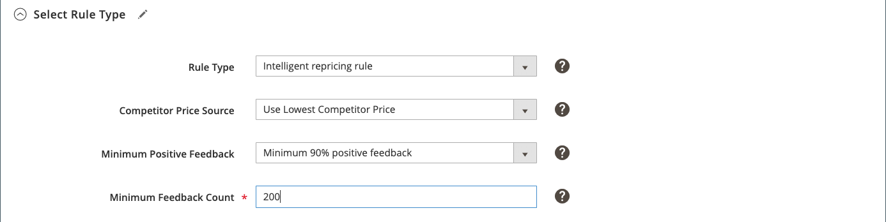

# 지능형 가격 조정 규칙: 규칙 유형 선택

>[!IMPORTANT]
>
>Amazon 지역이 로 설정된 경우 지능형 가격 조정 규칙이 제대로 작동하지 않습니다. `Inactive` 상태(온보딩 중). 가격 계산은 배송 요금에 따라 달라지며 지역은 다음 범위에 속해야 합니다. `Active` Amazon에서 동기화할 배송 요금의 상태입니다.  
>
>Amazon 계정에서 지역 상태를 업데이트하려면 설정 > 계정 정보 > 휴가 설정으로 이동합니다. 을(를) 참조하십시오 [Amazon: 휴가에 대한 상태 나열](https://sellercentral.amazon.com/gp/help/help.html?itemID=200135620/&quot;target=&quot;_blank)

지능형 가격 조정 규칙은 Amazon 경쟁업체의 가격을 사용하여 목록 가격을 결정합니다. 경쟁업체는 Amazon에 나와 동일한 제품을 나열하는 다른 판매자입니다.

지능형 가격 조정 규칙의 섹션은 다음과 같습니다.

- 규칙 유형 선택
- [경쟁업체 조건부 분산](./competitor-conditional-variances.md)
- [가격 조정](./price-adjustment.md)
- [최저 가격](./floor-price.md)
- [선택적 최고 가격](./optional-ceiling-price.md)

## 규칙 유형 구성

에서 규칙 유형 정의 _[!UICONTROL Select Rule Type]_섹션.

1. 대상 **[!UICONTROL Rule Type]**, 선택 `Intelligent repricing rule`.

   이 설정을 사용하면 _[!UICONTROL Competitor Price Source]_필드 및 [_[!UICONTROL Competitor Conditional Variances]_](./competitor-conditional-variances.md), [_[!UICONTROL Floor Price]_](./floor-price.md), 및 [_[!UICONTROL Optional Ceiling Price]_](./optional-ceiling-price.md) 섹션.

1. 대상 **[!UICONTROL Competitor Price Source]**&#x200B;옵션을 선택합니다.

   - **[!UICONTROL Use "Buy Box" Price]** - Amazon을 기반으로 Amazon 가격을 조정할 시기를 선택합니다. [[!DNL Buy Box]](./buy-box-competitor-pricing.md) 판매자 가격. A [!DNL Buy Box] 가격은 Amazon의 여러 판매자가 동일한 제품을 제공할 때 존재합니다. Amazon은 [!DNL Buy Box] 성능 요구 사항을 기반으로 한 판매자입니다. 상인들은 상인들에게서 이기기 위해 애쓴다 [!DNL Buy Box] 판매자 상태 및 제품 목록의 최대 가시성을 제공합니다.

   - **[!UICONTROL Use Lowest Competitor Price]** - 동일한 제품에 대한 경쟁업체 가격과 목록 가격을 비교 및 조정할 시기를 선택합니다. 이 옵션을 선택하면 _[!UICONTROL Minimum Positive Feedback]_및_[!UICONTROL Minimum Feedback Count]_ 필드가 활성화되어 있습니다.

1. 활성화된 경우 다음 옵션을 선택합니다. **[!UICONTROL Minimum Positive Feedback]**.

   - **[!UICONTROL All Competitor's Prices]** - 동일한 제품에 대한 모든 경쟁업체 가격을 기준으로 가격을 비교 및 조정할 시기를 선택합니다.

   - **[!UICONTROL Minimum 80/90/95/98% positive feedback]** - 동일한 제품에 대해 가격이 비교되는 경쟁업체를 제한할 시기를 선택합니다. 이 설정은 가장 낮은 가격 규칙을 적용하기 전에 긍정적인 피드백의 선택된 백분율 중 최소값을 갖도록 목록에 요구함으로써 경쟁자를 더 좁힙니다.

1. 활성화된 경우 숫자 값을 입력합니다. **[!UICONTROL Minimum Feedback Count]**.

   이 선택적인 수치 값은 경쟁 가격을 더욱 낮춥니다. 예를 들어, 판매자가 95%의 긍정적인 피드백 등급을 가지고 있지만 피드백 수가 다음의 경우 `20`가격을 수정할 경쟁 업체가 아닐 수 있습니다. 그러나 값을 입력하는 경우 `1000`, 판매자가 95%의 긍정적인 피드백과 최소 1000개의 판매자 검토를 보유해야 합니다.

>[!NOTE]
>
>이러한 경쟁업체 가격 책정 및 피드백 옵션을 사용하여 피드백이 좋지 않고 더 낮은 품질의 제품을 판매하는 경쟁업체에 대한 가격을 책정하는 것을 방지할 수 있습니다.

{width="600" zoomable="yes"}

| 필드 | 설명 |
|----------------------------------------|-----------------------------------------------------------------------------------------------------------------------------------------------------------------------------------------------------------------------------------------------------------------------------------------------------------------------------------------------------------------------------------------------------------------------------------------------------------------------------------------------------------------------------------------------------------------------------------------------------------------------------------------------------------------------------------------------------------------------------------------------------------------------------------------------------------------------------------------------------------------------------------------|
| [!UICONTROL Rule Type] | 규칙 유형을 선택합니다. 옵션:<ul><li>**[!UICONTROL Standard price rule]** - 이 규칙 유형을 사용하면 다음을 기준으로 Amazon 목록 가격을 특정 비율이나 고정 달러 금액만큼 증가 또는 감소시킬 수 있습니다. _[!UICONTROL Magento Price Source]_. </li><li>**[!UICONTROL Intelligent repricing rule]** - 이 규칙 유형을 사용하면 경쟁업체의 가격을 기준으로 Amazon 목록 가격을 조정할 수 있습니다. 이 옵션을 선택하면 _[!UICONTROL Minimum Positive Feedback]_및_[!UICONTROL Minimum Feedback Count]_ 필드가 활성화되어 있습니다.</li></ul> |
| [!UICONTROL Competitor Price Source] | 원하는 가격 출처를 선택합니다. 옵션:<ul><li>**[!UICONTROL Use "Buy Box" Price]** - Amazon을 기반으로 Amazon 가격을 조정하려면 이 옵션을 선택합니다. [[!DNL Buy Box]](./buy-box-competitor-pricing.md) 판매자 가격. A [!DNL Buy Box] 가격은 Amazon의 여러 판매자가 동일한 제품을 제공할 때 존재합니다. Amazon은 [!DNL Buy Box] 성능 요구 사항을 기반으로 한 판매자입니다. 상인들은 상인들에게서 이기기 위해 애쓴다 [!DNL Buy Box] 판매자 상태 및 제품 목록의 최대 가시성을 제공합니다.</li><li>**[!UICONTROL Use Lowest Competitor Price]** - 목록 가격을 다음과 비교하고 조정하려면 이 옵션을 선택합니다. [경쟁사 최저 가격](./lowest-competitor-pricing.md) 동일한 제품에 사용됩니다. 이 옵션을 선택하면 _[!UICONTROL Minimum Positive Feedback]_및_[!UICONTROL Minimum Feedback Count]_ 필드가 활성화되어 있습니다.</li></ul> |
| [!UICONTROL Minimum Positive Feedback] | 다음의 경우에만 활성 `Use Lowest Competitor Price` 이(가) 선택되었습니다. 옵션:<ul><li>**[!UICONTROL All Competitor's Prices]** - 동일한 제품에 대한 모든 경쟁업체 가격을 기준으로 가격을 비교 및 조정할 시기를 선택합니다.</li><li>**[!UICONTROL Minimum 80/90/95/98% positive feedback]** - 비교 대상 경쟁사를 제한하고 가격을 조정하고자 할 시기를 선택합니다. 이 설정은 긍정적인 피드백의 선택된 백분율 중 최소값을 선택한 다음 경쟁사 하위 집합의 가장 낮은 가격을 사용하도록 목록에 추가함으로써 경쟁사의 범위를 더 좁힙니다.</li></ul> |
| [!UICONTROL Minimum Feedback Count] | 다음의 경우에만 활성 `Use Lowest Competitor Price` 이(가) 선택되었습니다. 이 선택적인 수치 값은 경쟁 가격 비교를 더욱 좁혀줍니다. 예를 들어, 판매자가 95%의 긍정적인 피드백 등급을 가지고 있지만 피드백 수가 다음의 경우 `20`가격을 수정할 경쟁 업체가 아닐 수 있습니다. 그러나 값을 입력하는 경우 `1000`, 판매자가 95%의 긍정적인 피드백과 최소 1000개의 판매자 검토를 보유해야 합니다. |
