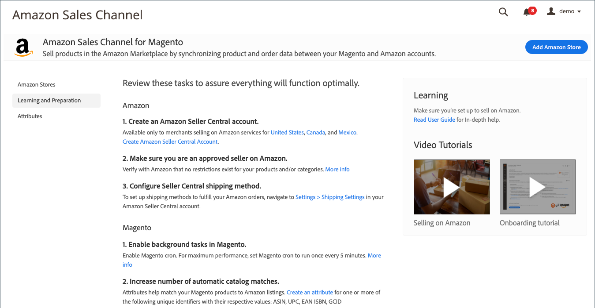

# [!UICONTROL Learning and Preparation]

_[!UICONTROL Learning and Preparation]_보기에는 Amazon 스토어를 통합하기 전에 권장되는 사전 설정 작업 목록이 표시됩니다. 또한 다음과 같은 학습 자료에 대한 링크도 제공합니다.

- 이 [사용 안내서](./overview.md)
- 비디오 자습서

{width="600" zoomable="yes"}
