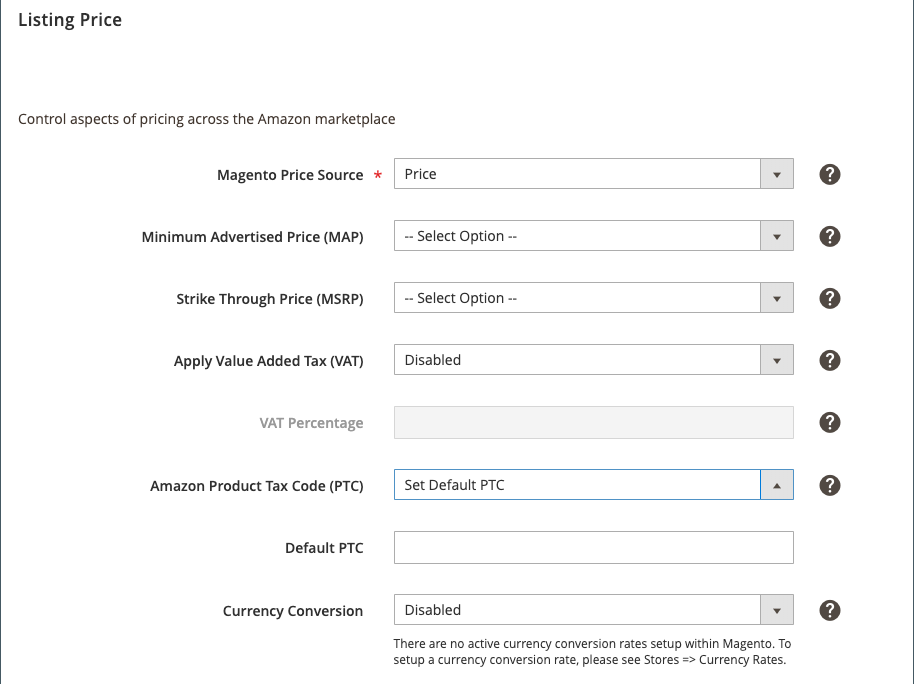

# [!UICONTROL Listing Price]

[!UICONTROL Listing Price] 설정은 저장소 목록 설정의 일부입니다. 목록 설정은 [스토어 대시보드](./amazon-store-dashboard.md)에서 액세스할 수 있습니다.

이러한 설정은 가격 소스로 사용할 [!DNL Commerce] 가격 특성을 정의하며, 이는 Amazon 목록의 기본(기본값) 가격 값입니다. 이 설정은 [가격 규칙](./pricing-rule-general-settings.md)에서 _[!UICONTROL Magento Price Source]_에 대해 설정된 값을 기준으로 Amazon 목록 가격을 자동으로 조정하는 데 사용됩니다.

[가격 범위](./price-scope.md)를 전역 또는 웹 사이트로 구성할 수 있습니다. 가격 범위가 `Global`(으)로 설정된 경우 모든 스토어/웹 사이트에 대해 단일 가격 원본이 있습니다. 가격 범위가 `Website`(으)로 설정된 경우 가격 원본은 웹 사이트 가격(사용 가능한 경우) 및 기본(글로벌) 가격의 대체 논리를 사용합니다.

목록 규칙이 둘 이상의 웹 사이트에 적용되도록 설정된 경우 웹 사이트 가격이 사용되는 순서는 [목록 규칙](./listing-rules.md)에 정의된 웹 사이트 우선 순위 설정에 따라 결정됩니다. 이러한 규칙을 사용하면 카탈로그 전반에서 제품 가격을 정의할 수 있습니다. 웹 사이트 가격 범위를 사용 중인지 확인하려면 [카탈로그 가격 범위](https://experienceleague.adobe.com/docs/commerce-admin/catalog/products/pricing/catalog-price-scope.html)를 참조하세요.

_[!UICONTROL Magento Price Source]_,_[!UICONTROL Minimum Advertised Price (Map)]_ 및 _[!UICONTROL Strike Through Price (MSRP)]_에 나열된 옵션에는 구성된 가격 책정 특성이 포함됩니다. 가격 특성은 `Price`(으)로 설정된 스토어 소유자 값에 대한 카탈로그 입력 유형의 [!DNL Commerce] 제품 특성입니다. [특성 입력 형식](https://experienceleague.adobe.com/docs/commerce-admin/catalog/product-attributes/attributes-input-types.html)을 참조하세요.

## 목록 가격 설정 구성 {#configure-listing-price-settings}

1. 스토어 대시보드에서 **[!UICONTROL Listing Settings]**&#x200B;을(를) 클릭합니다.

1. _[!UICONTROL Listing Price]_섹션을 확장합니다.

1. **[!UICONTROL Magento Price Source]**(필수)에 대해 옵션을 선택하십시오.

   기본값은 `Price`입니다. 이 설정은 Amazon 목록에 사용되는 가격 소스를 결정합니다. [가격 규칙](./pricing-products.md)을(를) 만드는 경우 여기에서 선택한 특성에 대해 정의된 값에 규칙이 적용됩니다. 구성된 가격책정 속성을 선택할 수 있습니다. 그러나 선택한 특성이 제품에 대해 채워져 있지 않으면 가격 책정 규칙을 적용하여 게시된 Amazon 목록 가격을 결정할 때 제품에 대한 가격 원본의 기본값이 다시 `Price`(으)로 설정됩니다.

1. **[!UICONTROL Minimum Advertised Price (MAP)**]에 대해 옵션을 선택하십시오.

   기본값은 선택 안 함입니다. 이 설정을 사용하면 제품에 대한 MAP(최소 광고 가격)을 사용할 수 있습니다. 가격책정 속성을 정의하고 제품의 목록 가격이 결정된 최소 가격(가격책정 출처 및 규칙에 따라)보다 낮은 경우 이 값은 목록에 대한 MAP이 됩니다. 이 설정을 사용하면 제품의 최소 가격을 계속 제어하면서 [가격 규칙](./pricing-products.md)을 구현할 수 있습니다. 목록 가격이 너무 낮지 않도록 하려면 MAP으로 사용할 가격책정 속성을 선택합니다. 그러나 선택한 가격 책정 필드가 제품에 대해 정의되지 않은 경우 MAP이 사용되지 않습니다.

1. **[!UICONTROL Strike Through Price (MSRP)]**&#x200B;에 대해 옵션을 선택하십시오.

   기본값은 선택 안 함입니다. 이 설정은 제품에 대한 제조업체의 권장 소매 가격(MSRP)으로 사용되는 가격책정 속성을 결정합니다. 목록 가격이 정의된 MSRP보다 낮은 경우 Amazon 목록에 계산된 &quot;저장&quot; 금액 및 백분율과 함께 낮은 목록 가격의 MSRP 가격 취소선이 표시됩니다. 그러나 선택한 가격 책정 필드가 제품에 대해 정의되지 않은 경우 MSRP가 계산되지 않습니다.

   >[!NOTE]
   >
   >이 설정은 [Buy Box](./buy-box-competitor-pricing.md) 위치를 얻은 목록에만 적용됩니다. 이 Buy Box은 Amazon이 FBA/Prime 배송, 가용성, 판매자 성과 등 다른 요인과 함께 일반적으로 가장 좋은 가격으로 나열된 제품을 보유한 판매자에게 부여합니다.

1. **부가가치세(VAT) 적용**&#x200B;에 대해 다음 옵션을 선택하십시오.

   - `Disabled` - (기본값) 목록 가격에 VAT를 적용하지 않으려는 경우 선택합니다.

   - `Enabled` - 목록 가격에 VAT를 적용할 시기를 선택합니다. VAT는 일반적으로 유럽 국가에서 판매세로 사용되며 Amazon 내의 최종 장부 가격에 추가됩니다. [최저 가격](./floor-price.md)에 도달하지 않는 한 지능형 가격 책정 규칙 내에서 사용되는 목록의 최종 가격에는 VAT가 적용되지 않습니다.

   >[!NOTE]
   >
   >유럽 연합 (EU)의 기업들은 고객이 세금을 송금할 수 있도록 비즈니스 구매자에게 송장을 보내야 합니다. 이러한 송장을 생성하고 직접 세금을 계산하거나 Amazon의 VAT 계산 서비스와 같은 세금 계산 서비스를 사용할 수 있습니다. Amazon에서는 [Amazon VAT 계산 서비스](https://sell.amazon.co.uk/learn/vat-resources?ref_=asuk_soa_rd&amp;)에 등록하는 것이 좋습니다. 다른 방법을 선택하는 경우 VAT 규정 준수에 대한 책임이 있습니다.>
   >
   >Amazon에서 VAT 계산 서비스 계정을 확인하고 활성화하는 데 10~14일이 걸릴 수 있습니다.

1. **[!UICONTROL VAT Percentage]**&#x200B;의 경우 VAT 세율 값을 입력하십시오.

   기본값은 `0.00`입니다. 이 값은 상장가격에 가산할 VAT 금액을 계산하는 데 사용된다. `10.2`을(를) 입력하면 목록 가격에 10.20% VAT가 적용됩니다. VAT(부가가치세) 적용 필드가 `Disabled`(으)로 설정된 경우 이 필드가 비활성화됩니다.

1. **(영국 저장소만 해당)** **[!UICONTROL Amazon Product Tax Code (PTC)]**&#x200B;의 경우 다음 옵션을 선택하세요.

   - `Do Not Manage PTC` - (기본값) 서드파티 세금 계산 서비스를 사용하고 있거나 이미 [!DNL Amazon Seller Central] 계정에 모든 세금 계산이 설정되어 있는 경우 선택합니다. 선택하면 Amazon 판매 채널이 [!DNL Amazon Seller Central] 계정에 제품 세금 코드 정보를 전송하지 않습니다.

   - `Set Default PTC` - 모든 제품에 사용할 범용 제품 세금 코드(PTC)가 있는 경우 선택합니다. 선택한 경우 _[!UICONTROL Default PTC]_을(를) 완료해야 합니다.

      - **[!UICONTROL Default PTC]**&#x200B;의 경우 적격한 모든 Amazon 목록에 사용할 기본 PTC를 입력합니다. [!DNL Amazon Seller Central] 계정에 기본 PTC가 설정되어 있으면 이 필드를 비워 둡니다. 이 필드를 변경해도 기존 Amazon 목록에는 영향을 주지 않습니다. 기존 목록의 기본 PTC를 변경하려면 목록이 [종료](./end-listings-manually.md)되고 새 목록이 작성되어야 합니다.

   >[!NOTE]
   >
   >Amazon의 VAT 계산 서비스를 사용하는 경우 제품에 대한 세금 범주를 알고 있어야 합니다. PTC는 EU에서 구매하는 B2B에 대한 Amazon의 세금 범주 ID 코드입니다. [Amazon의 제품 세금 코드](https://sellercentral.amazon.com/gp/help/help.html?itemID=G200794510&amp;language=en_US){target="_blank"}를 참조하세요.

1. **[!UICONTROL Currency Conversion]**&#x200B;에 대해 옵션을 선택하십시오.

   기본값은 `Disabled`입니다. 이러한 옵션은 [!DNL Commerce] [통화](https://experienceleague.adobe.com/docs/commerce-admin/config/general/currency-setup.html) 설정에 따라 다릅니다. 사용할 수 있는 옵션이 없으면 통화 설정을 설정합니다.

1. 완료되면 **[!UICONTROL Save listing settings]**&#x200B;을(를) 클릭합니다.

{width="500" zoomable="yes"}

| 필드 | 설명 |
|---------------------------------------------|------------------------------------------------------------------------------------------------------------------------------------------------------------------------------------------------------------------------------------------------------------------------------------------------------------------------------------------------------------------------------------------------------------------------------------------------------------------------------------------------------------------------------------------------------------------------------------------------------------------------------------------------------------------------------------------------------------------------------------------------------------------------------------------------------------------------------------------------------------------------------------------------------------------------------------------------------------------------------------------------------------------------|
| [!UICONTROL Magento Price Source] | Amazon 목록을 만들 때 사용할 가격 소스를 결정합니다. 기본값은 `Price`입니다. `Amazon Price` 또는 `Special Price`과(와) 같은 다른 특성을 선택하면 해당 특성에 대해 정의된 값이 Amazon 목록에 사용됩니다. 그러나 선택한 특성이 정의되지 않으면 `Price`이(가) 사용됩니다. |
| [!UICONTROL Minimum Advertised Price (MAP)] | MAP 가격에 대한 [!DNL Commerce] 특성입니다. MAP 옵션을 선택하면 목록 가격이 MAP 가격보다 낮은 경우 Amazon 목록이 MAP 가격으로 자동 설정됩니다. |
| [!UICONTROL Strike Through Price (MSRP)] | MSRP 가격을 나타내는 [!DNL Commerce] 특성입니다. Amazon 리스팅 가격이 MSRP보다 낮은 경우 MSRP 가격과 리스팅 가격의 취소선을 표시합니다. 이 설정은 &quot;저장&quot; 금액과 백분율을 계산하는 데에도 사용되지만, 이 기능은 [Buy Box](./buy-box-competitor-pricing.md) 위치를 얻은 목록에만 적용됩니다. |
| [!UICONTROL Apply Value Added Tax (VAT)] | 부가세는 유럽 연합에서 판매자들이 사용한다.  VAT를 목록 가격에 추가하지 않으려면 `Disabled`을(를) 선택하십시오.  `Enabled`을(를) 선택한 다음 목록 가격에 VAT를 적용할 VAT 비율을 입력합니다. |
| [!UICONTROL VAT Percentage] | Amazon 목록의 목록 가격에 추가할 VAT 금액을 계산하는 데 사용할 백분율을 정의합니다.   `5`을(를) 입력하면 모든 가격 책정 규칙이 적용된 후 최종 목록 가격에 5%의 VAT가 적용됩니다. [floor](./floor-price.md) 또는 [ceiling](./optional-ceiling-price.md)을(를) 충족하지 않는 한 지능형 가격 책정 규칙 내에서 사용되는 목록의 최종 가격에는 VAT 세금이 적용되지 않습니다. |
| [!UICONTROL Amazon Product Tax Code (PTC)] | (영국 상점에만 표시됨) Amazon 판매 채널이 제품 세금 코드 정보를 [!DNL Amazon Seller Central] 계정에 전송하는지 여부를 결정합니다.   서드파티 세금 계산 서비스를 사용하고 있거나 이미 [!DNL Amazon Seller Central] 계정에 모든 세금 계산을 설정한 경우 **PTC 관리 안 함**&#x200B;을 선택합니다. 이 옵션으로 설정하면 Amazon 판매 채널이 [!DNL Amazon Seller Central] 계정에 제품 세금 코드 정보를 전송하지 않습니다.  모든 제품에 사용할 범용 제품 세금 코드가 있으면 **기본 PTC 설정**&#x200B;을 선택합니다.  Amazon의 제품 세금 코드](https://sellercentral.amazon.com/gp/help/help.html?itemID=G200794510&amp;language=en_US){target="_blank"}를 참조하세요.[ |
| [!UICONTROL Default PTC] | **Amazon PTC(제품 세금 코드)**&#x200B;이(가) `Set Default PTC`(으)로 설정된 경우에만 나타납니다. 적격한 모든 Amazon 목록에 사용할 기본 PTC를 입력합니다. [!DNL Amazon Seller Central] 계정에 기본 PTC가 설정되어 있으면 이 필드를 비워 둡니다.   이 필드를 변경해도 기존 목록에 영향을 주지 않습니다. 목록은 [종료](./end-listings-manually.md)이어야 하며, 변경 내용을 적용하려면 새 목록을 만들어야 합니다. |
| [!UICONTROL Currency Conversion] | [!DNL Commerce] 상점 기본 통화를 기본 Amazon 통화로 정확하게 변환하여 해당 통화로 목록 가격을 게시할 수 있습니다. 통화 전환은 항상 [!DNL Commerce] 기본 통화를 기반으로 합니다.  다른 통화를 사용할 수 있는 경우에도 기본 [!DNL Commerce] 및 Amazon 통화를 볼 수 있습니다. 기본 [!DNL Commerce] 통화가 기본 Amazon 통화와 일치하는 경우 통화 전환을 사용하지 않도록 설정하십시오.  예를 들어 [!DNL Commerce] 기본 통화가 CAD(캐나다 달러)이고 Amazon 기본 통화가 USD인 경우 통화 변환을 활성화하고 전환율 CAD에서 USD로의 전환율을 선택해야 합니다. 제공된 옵션은 내장된 [!DNL Commerce] 통화 전환을 기반으로 합니다. 찾고 있는 옵션이 없으면 [통화를 설정 [!DNL Commerce]](https://experienceleague.adobe.com/docs/commerce-admin/stores-sales/site-store/currency/currency-configuration.html)합니다. |

**빠른 액세스** - [!UICONTROL Listing Settings] 섹션

- [[!UICONTROL Product Listing Actions]](./product-listing-actions.md)
- [[!UICONTROL Third Party Listings]](./third-party-listing-settings.md)
- [[!UICONTROL Listing price]](./listing-price.md)
- [[!UICONTROL (B2B) Business Price]](./business-pricing.md)
- [[!UICONTROL Stock / Quantity]](./stock-quantity.md)
- [[!UICONTROL Fulfilled By]](./fulfilled-by.md)
- [[!UICONTROL Catalog search]](./catalog-search.md)
- [[!UICONTROL Product Listing Condition]](./product-listing-condition.md)
