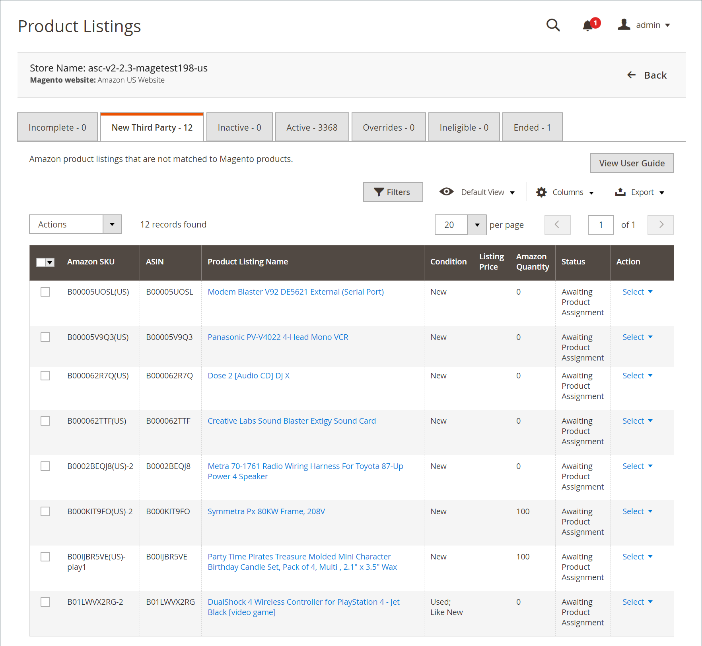

# 새 타사 목록

다음 _[!UICONTROL New Third Party]_탭에는 의 제품과 일치하지 않는 기존 Amazon 목록이 표시됩니다. [!DNL Commerce] 카탈로그. 수량, 가격, 처리 시간 등에 대해 목록 관리를 사용하려면 각 Amazon 목록을 의 제품에 일치(할당)해야 합니다. [!DNL Commerce] 카탈로그. 의 제품에 목록을 할당하는 몇 가지 옵션이 있습니다. [!DNL Commerce] 카탈로그.

아래 _[!UICONTROL Actions]_:

- **[!UICONTROL Create New Catalog Product(s)]**: Amazon 목록의 정보를 사용하여 [!DNL Commerce] 카탈로그. 이 프로세스는 Amazon 목록을 새 카탈로그 제품에 자동으로 일치시킵니다. 다음을 참조하십시오 [카탈로그 제품 만들기 및 할당](./creating-assigning-catalog-products.md).

- **[!UICONTROL Attempt Automatic Match]**: 선택한 목록의 자동 일치를 현재 목록을 기반으로 카탈로그에 시도하도록 선택합니다 [카탈로그 검색](./catalog-search.md) 목록 설정의 옵션입니다. 다음을 수정하는 경우: _[!UICONTROL Catalog Search]_옵션, 이 작업을 사용하면 일치 프로세스를 다시 시도할 수 있습니다.

아래 _[!UICONTROL Select]_:

- **[!UICONTROL Assign Catalog Product]**: 목록의 항목을 의 제품과 일치시키려면 선택합니다. [!DNL Commerce] 카탈로그를 수동으로 만드는 중입니다. 다음을 참조하십시오 [카탈로그 제품 만들기 및 할당](./creating-assigning-catalog-products.md).

- **[!UICONTROL Create New Catalog Product]**: Amazon 목록의 정보를 사용하여 [!DNL Commerce] 카탈로그. 이 프로세스는 Amazon 목록을 새 카탈로그 제품에 자동으로 일치시킵니다. 다음을 참조하십시오 [카탈로그 제품 만들기 및 할당](./creating-assigning-catalog-products.md).

- **[!UICONTROL View Details]**: 다음을 포함한 목록 세부 정보를 보도록 선택합니다. [활동 로그 나열](./product-listing-details.md#listing-activity-log), [Buy Box 경쟁업체 가격](./product-listing-details.md#buy-box-competitor-pricing), 및 [경쟁사 최저 가격](./product-listing-details.md#lowest-competitor-pricing). 이 작업은 보기 전용입니다. 목록 세부 사항을 변경할 수 없습니다. 다음을 참조하십시오 [세부 사항 보기](./product-listing-details.md).

>[!NOTE]
>
>목록이 처리 중인 경우 탭 위에 목록 수를 나타내는 메시지가 표시됩니다.

Amazon 판매 채널 홈 페이지는 몇 가지 공통점을 공유합니다. [작업 영역 컨트롤](./workspace-controls.md) 을 사용하면 표시되는 데이터를 사용자 정의할 수 있습니다.

## 기본 열

| 열 | 설명 |
|---|---|
| [!UICONTROL Amazon Seller SKU] | 제품, 옵션, 가격 및 제조업체를 식별하기 위해 Amazon이 제품에 할당한 SKU(Stock Keeping Unit). |
| [!UICONTROL ASIN] | 항목을 식별하는 10개의 문자 및/또는 숫자로 구성된 고유 블록입니다.  ASIN은 [!DNL Amazon Standard Identification Number]. ASIN은 항목을 식별하는 10개의 문자 및/또는 숫자로 구성된 고유한 블록입니다. 책의 경우 ASIN은 ISBN 번호와 동일하지만 다른 모든 제품의 경우 항목이 카탈로그에 업로드되면 새 ASIN이 생성됩니다. Amazon의 제품 세부 사항 페이지에서 ASIN 항목을 확인할 수 있으며, 항목과 관련된 자세한 내용도 확인할 수 있습니다. |
| [!UICONTROL Product Listing Name] | 제품 이름. |
| [!UICONTROL Condition] | 다음 [조건](./product-listing-condition.md) 제품. |
| [!UICONTROL Listing Price] | 가격 출처 및 적용 가능한 가격책정 규칙으로 정의된 품목의 목록 가격을 식별합니다. |
| [!UICONTROL Amazon Quantity] | 제품이 Amazon에 활성 상태로 나열될 때 사용할 수 있는 수량입니다. |
| [!UICONTROL Status] | Amazon으로 정의된 목록의 상태. |
| [!UICONTROL Action] | 특정 목록에 적용할 수 있는 사용 가능한 작업 목록입니다. 작업을 적용하려면 **[!UICONTROL Select]** 다음에서 _[!UICONTROL Action]_열을 만들고 옵션을 선택합니다.<ul><li>[[!UICONTROL Assign Catalog Product]](./creating-assigning-catalog-products.md)</li><li>[[!UICONTROL Create New Catalog Product]](./creating-assigning-catalog-products.md)</li><li>[[!UICONTROL View Details]](./product-listing-details.md)</li></ul> |
