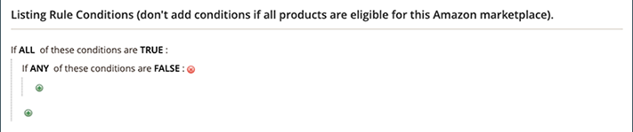

# 예: 조건 정의

## 조건

조건의 굵게 표시된 영역을 클릭하여 다양한 옵션을 볼 수 있습니다.

**선택한 웹 사이트 내의 모든 제품이 적합한 경우 조건을 추가하지 마십시오.**

>[!NOTE]
>
>Amazon 시스템과 직접 통신하는 복잡한 백엔드 프로세스 세트가 있습니다. 나열하려는 항목의 수와 Amazon 시스템의 사용 빈도에 따라(예: 블랙 프라이데이) Amazon에 항목이 나열되는 데 시간이 걸릴 수 있습니다.

의 조건 섹션을 참조하십시오. [장바구니 가격 규칙 생성](https://experienceleague.adobe.com/docs/commerce-admin/marketing/promotions/catalog-rules/price-rules-catalog-create.html).

## 조건 정의

이 프로세스는 카탈로그 설정에 따라 간단하거나 자세히 지정할 수 있습니다. 다음과 같은 경우에 조건을 설정할 수 있습니다. `ALL` 또는 `ANY` 다음 중 하나의 조건을 정의합니다. `TRUE` 또는 `FALSE` 제품의 경우 제품이 Amazon에 나열될 수 있습니다.

조건은 기존 제품 속성 값을 기반으로 합니다. 모든 제품에 규칙을 적용하려면 조건 섹션을 비워 둡니다.

>[!NOTE]
>
>특정 제품 속성에 따라 조건을 정의하려면 다음을 설정합니다. **[!UICONTROL Use for Promo Rule Conditions]** 속성에 대해 를 로 설정 `Yes`. 다음에서 이 설정에 액세스할 수 있습니다. [Storefront 속성](https://experienceleague.adobe.com/docs/commerce-admin/catalog/product-attributes/product-attributes-add.html) 속성용 페이지입니다.

{width="500"}

이 예제의 규칙은 이 포함된 모든 카탈로그 제품에 대해 Amazon 자격 조건을 설정하는 규칙을 정의합니다. _AMAZON FBA_ 속성이 로 설정됨 `Yes`.

규칙 명령문에는 두 개의 굵은 링크가 있으며, 이 링크를 클릭하면 명령문의 해당 부분에 대한 옵션이 표시됩니다. 굵게 옵션을 변경하지 않고 조건을 저장하면 규칙이 모든 제품에 적용됩니다.

- 클릭 **[!UICONTROL ALL]** 다음 중 하나를 선택합니다. `ALL` 또는 `ANY`.
- 클릭 **[!UICONTROL TRUE]** 다음 중 하나를 선택합니다 `TRUE` 또는 `FALSE`.
- 모든 제품에 규칙을 적용하려면 조건을 변경하지 않고 둡니다.

이러한 값의 조합을 변경하여 다른 조건을 만들 수 있습니다. 이 예에서는 다음 조건이 사용됩니다.

`If ALL of these conditions are TRUE:`

1. Add ( 를 클릭합니다.) 아이콘을 클릭하고 조건 조합 또는 제품 속성과 같이 조건을 기반으로 할 속성을 선택합니다.

   - **[!UICONTROL Conditions Combination]** - 다른 집합 만들기를 허용하도록 선택합니다. `All/Any` 및 `True/False` 기존 집합 내의 조건.

     {width="500"}

   - **[!UICONTROL Product Attribute]** - 제품 속성은 속성 설정에 따라 다릅니다. 속성이 목록에 나타나도록 하려면 이관 규칙 조건에서 사용되도록 구성해야 합니다. 다음을 참조하십시오. _프로모션 규칙 조건에 사용_ 위치: [제품 속성](https://experienceleague.adobe.com/docs/commerce-admin/catalog/product-attributes/product-attributes.html).

     아래 목록에서 **[!UICONTROL Product Attribute]**&#x200B;를 클릭하고 조건의 기반으로 사용할 속성을 선택합니다. 이 예제에서 선택한 조건은 입니다. `Amazon FBA`.

     {width="350"}

     선택한 조건이 문에 나타나고 그 뒤에 굵은 링크가 두 개 더 나타납니다. 옵션은 선택하는 제품 속성에 따라 다릅니다.

     속성을 설정한 후에는 변경할 수 없습니다. 속성을 변경하려면 줄을 삭제하고 새 속성을 추가해야 합니다. 삭제( )를 클릭하여 조건 라인을 삭제할 수 있습니다.) 아이콘의 라인 끝입니다.

      1. 클릭 **[!UICONTROL is]** 및 충족시킬 제품에 대한 조건을 설명하는 비교 연산자를 선택합니다.

         이 예에서 비교 연산자는 입니다. `is`. 사용 가능한 옵션은 이전 단계에서 선택한 속성에 따라 다릅니다. 옵션은 수치 이상, 같음 및 보다 작은 값 중 적어도 하나를 포함하거나 포함하지 않는 일치 값과 같은 다른 비교 옵션을 포함할 수 있습니다. 이 예에서 옵션은 다음과 같습니다 `is` 및 `is not`.

      1. 클릭 **[!UICONTROL ...]** 조건의 기반이 되는 속성 값을 선택합니다.

         옵션은 속성의 설정에 따라 다릅니다. 옵션을 선택하거나 조건에 대한 텍스트 또는 숫자 값을 입력하라는 메시지가 표시될 수 있습니다. 이 예제에서 선택 항목은 다음과 같습니다. `Yes`.

         선택한 항목이 문에 표시되어 조건을 완료합니다.

         {width="500"}

   이 조건은 완료되었습니다. 명시된 바와 같이, 이 조건은 귀하의 모든 제품을 의미합니다 [!DNL Commerce] Amazon FBA 속성이 값으로 설정된 카탈로그 `Yes` 지역 및 스토어의 Amazon에 나열할 수 있습니다. 조건 라인을 더 추가하여 적격 제품의 범위를 더 좁힐 수 있습니다.

1. 문에 다른 조건 라인을 추가하려면 1단계로 돌아가서 원하는 조건이 모두 완료될 때까지 프로세스를 반복합니다.

삭제( )를 클릭하여 언제든지 조건문의 행을 삭제할 수 있습니다.) 아이콘의 라인 끝입니다.
