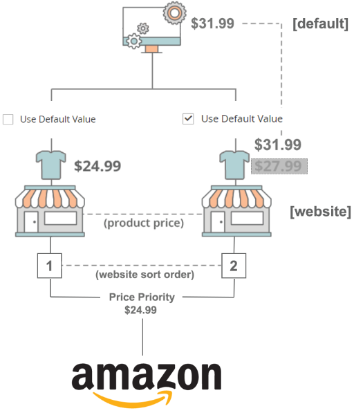

# 가격 우선 순위 논리

다음 예에서 시스템은 사용자가 $31.99, $24.99 또는 $27.99를 게시해야 하는지 여부를 어떻게 결정합니까?

{width="400"}

제품이 두 웹 사이트에 있고 웹 사이트당 가격이 다른 경우 사용되는 가격을 결정하려면 가격 우선 순위 논리(에 의해 결정됨)를 사용합니다. [정렬 순서](https://experienceleague.adobe.com/docs/commerce-admin/stores-sales/site-store/store-views.html) value).

상점의 정렬 순서를 보려면 **[!UICONTROL Stores]** > **[!UICONTROL All Stores]** 다음에서 _관리자_ 사이드바. 다음에서 _[!UICONTROL Web Site]_열에서 웹 사이트 이름을 클릭합니다. 다음_[!UICONTROL Web Site Information]_ 페이지에 다음이 표시됩니다. _[!UICONTROL Sort Order]_웹 사이트에 대한 설정 - 웹 사이트의 우선 순위를 결정합니다. 값 `1` 가장 높은 우선 순위를 나타냅니다.

제품 가격이 로 설정된 경우 `Use Default`, 웹 사이트 가격 값 대신 기본 가격 값으로 돌아갑니다.

## 예 1

|         | 웹 사이트 우선 순위 | 가격(웹 사이트) | 기본값 사용 |
|---------|------------------|-----------------|-------------|
| 기본값 | 0 | $31.99 | — |
| 스토어 1 | 1 | $24.99 | 아니요 |
| 스토어 2 | 2 | $27.99 | 예 |

- 다음 **[!UICONTROL Magento Price Source]** (에 정의됨) [목록 가격](./listing-price.md) 이(가) (으)로 설정됩니다. `Price` 특성.
- Store 1(에 의해 정의됨)인 가장 높은 웹 사이트 우선 순위를 가진 웹 사이트를 봅니다. [정렬 순서](https://experienceleague.adobe.com/docs/commerce-admin/stores-sales/site-store/store-views.html) value).
- 스토어 1이 웹 사이트 가격을 사용하도록 설정되었기 때문에(기본값 사용 = 아니요), 게시 가격은 $24.99입니다.

## 예제 2

|         | 웹 사이트 우선 순위 | 가격 웹 사이트 | 기본값 사용 |
|---------|------------------|---------------|-------------|
| 기본값 | 0 | $31.99 | -- |
| 스토어 1 | 1 | $24.99 | 예 |
| 스토어 2 | 2 | $27.99 | 아니요 |

- 다음 **[!UICONTROL Magento Price Source]** (에 정의됨) [목록 가격](./listing-price.md) 이(가) (으)로 설정됩니다. `Price` 특성.
- Store 1(에 의해 정의됨)인 가장 높은 웹 사이트 우선 순위를 가진 웹 사이트를 봅니다. [정렬 순서](https://experienceleague.adobe.com/docs/commerce-admin/stores-sales/site-store/store-views.html) value).
- 스토어 1 이후 **은(는) 아님** 웹 사이트 가격을 사용하도록 설정하고(기본값 = 예 사용), 정렬 순서로 다음 웹 사이트를 봅니다.
- 스토어 2 이후 **은(는)** 웹 사이트 가격을 사용하도록 설정된 경우(기본값 사용 = 아니요), 게시된 가격은 $27.99입니다.

## 예제 3

|         | 웹 사이트 우선 순위 | 가격 웹 사이트 | 기본값 사용 |
|---------|------------------|---------------|-------------|
| 기본값 | 0 | $31.99 | $30.00 |
| 스토어 1 | 1 | $24.99 | -- |
| 스토어 2 | 2 | $27.99 | $20.00 |

이 예에서는 _에 대해 다른 값을 선택하는 경우 사용되는 비가격 값을 추가합니다[!UICONTROL Magento Price Source_] (에 정의됨) [목록 가격](./listing-price.md) 설정)을 참조하십시오. 비가격 값은 항상 가격을 대체 가격으로 사용합니다.

- 다음 **[!UICONTROL Magento Price Source]** (정의됨 [[!UICONTROL Listing Price]](./listing-price.md) settings)가 로 설정되어 있습니다. `Non-Price`.
- 웹 사이트 우선 순위가 가장 높은 웹 사이트를 봅니다. `Store 1`(정의됨: [정렬 순서](https://experienceleague.adobe.com/docs/commerce-admin/stores-sales/site-store/store-views.html) value).
- 스토어 1 이후 **은(는) 아님** 을(를) 사용하도록 설정 `Non-Price` 속성에서 정렬 순서로 다음 웹 사이트를 봅니다.
- 스토어 2 이후 **은(는)** 을(를) 사용하도록 설정 `Non-Price` 속성(비가격) [웹 사이트] = $20.00). 게시된 가격은 $20.00입니다.
