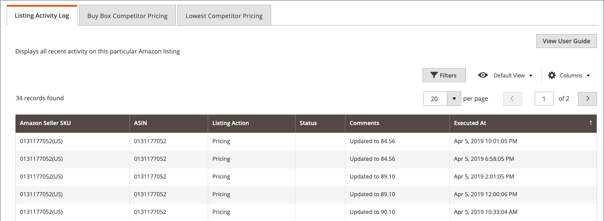

# Amazon 목록 세부 정보 보기

다음 _[!UICONTROL Product Listing Details]_이 페이지에는 개별 SKU/제품에 대한 변경 사항을 보여 주는 목록 활동 로그를 포함하여 활성 제품 목록에 대한 추가 정보가 표시됩니다. 이 정보는 제품 및 개별 SKU/제품 변경 사항에 대한 경쟁 지표를 이해하는 데 도움이 됩니다. 이 페이지에 대한 추가 정보는 다음과 같습니다.

- **[!UICONTROL Listing Details]** - 이름 및 Amazon 판매자 SKU를 포함한 제품 세부 정보
- **[!UICONTROL Listing Activity Log]** - 가격책정 및 수량/재고 변경과 같이 이 목록에 대해 발생한 모든 변경의 내역 레코드. 추가 작업이 필요하지 않습니다. 이 로그는 변경 내용을 이해하기 위해 제공됩니다.
- **[!UICONTROL Buy Box Competitor Pricing]** - Amazon 데이터 [[!DNL Buy Box]](./buy-box-competitor-pricing.md) 상태 및 경쟁업체 가격 책정
- **[!UICONTROL Lowest Competitor Pricing]** - 가장 낮은 Amazon 경쟁업체의 가격 및 피드백 정보에 대한 정보입니다.

Amazon 판매 채널 홈 페이지는 몇 가지 공통점을 공유합니다. [작업 영역 컨트롤](./workspace-controls.md) 을 사용하면 표시되는 데이터를 사용자 정의할 수 있습니다.

## 목록 세부 정보

표시되는 제품 정보에는 다음이 포함됩니다.

- _[!UICONTROL Amazon Name]_
- _[!UICONTROL Catalog (Magento) SKU]_
- _[!UICONTROL Amazon Seller SKU]_

{width="600" zoomable="yes"}

## 활동 로그 나열 {#listing-activity-log}

Amazon 목록에 대한 모든 최근 활동을 표시합니다. 표시되는 정보에는 다음이 포함됩니다.

- Amazon 판매자 SKU: 목록에 대해 정의된 SKU(Stock Keeping Unit)를 식별합니다.
- ASIN: 10자리 Amazon 제품 식별자를 식별합니다.
- 목록 작업: 목록에 대해 발생한 작업 유형을 식별합니다.
- 설명: 발생한 목록 작업 유형과 관련된 추가 세부 정보를 제공합니다.
- 실행 날짜: 작업이 발생한 날짜 및 시간을 식별합니다.

{width="600" zoomable="yes"}
__

## Buy Box 경쟁업체 가격 {#buy-box-competitor-pricing}

이 탭에는 를 보유한 Amazon 판매자에 대한 정보가 표시됩니다. [[!DNL Buy Box]](./buy-box-competitor-pricing.md) 목록에 대한 위치입니다. 이 정보는 Amazon에서 경쟁업체의 가격 포지셔닝을 파악하는 데 사용할 수 있습니다. 표시되는 정보에는 다음이 포함됩니다.

- ASIN: 10자리 Amazon 제품 식별자.
- 판매자임: 판매자가 [!DNL Buy Box] 판매자. 예 / 아니요.
- 조건: 목록에 대해 정의된 조건을 식별합니다.
- 목록 가격: 목록이 게재된 가격을 식별합니다.
- 출하 가격: 목록에 추가된 출하 가격을 식별합니다.
- 도착 가격: 리스팅 가격과 리스팅에 대한 운송 가격을 식별합니다.
- 마지막 업데이트: Amazon에서 가격 정보가 업데이트된 날짜와 시간을 식별합니다.

{width="600" zoomable="yes"}

## 경쟁사 최저 가격 {#lowest-competitor-pricing}

이 탭에는 동일한 목록에 대한 Amazon 경쟁업체에 대한 정보가 표시됩니다. 이 정보는 가격 포지셔닝 및 [경쟁사 최저 가격](./lowest-competitor-pricing.md). 표시되는 정보에는 다음이 포함됩니다.

- ASIN: 10자리 Amazon 제품 식별자.
- 조건: 목록에 대해 정의된 조건을 식별합니다.
- 이행 채널: 이행 책임자를 식별합니다. 옵션: 판매자/Amazon.
- 목록 가격: 목록이 게재된 가격을 식별합니다.
- 출하 가격: 목록에 추가된 출하 가격을 식별합니다.
- 도착 가격: 리스팅 가격과 리스팅에 대한 운송 가격을 식별합니다.
- 피드백 등급: 최저가 판매자에 대한 Amazon 피드백 등급을 식별합니다.
- 피드백 수: 최저가 판매자의 Amazon 피드백 수를 식별합니다.
- 마지막 업데이트: Amazon에서 가격 정보가 업데이트된 날짜와 시간을 식별합니다.

{width="600" zoomable="yes"}
