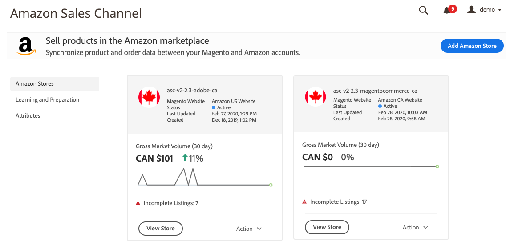

# 스토어 통합

Amazon 판매 채널을 시작하려면 Amazon 판매 채널 저장소를 생성(추가)하고 Amazon 판매자 계정에 연결해야 합니다. 이 두 단계는 [!DNL Commerce] 및 Amazon 계정을 통합하여 데이터를 공유하고 제품을 동기화하는 등의 작업을 수행합니다.

_스토어를 연결하려면  [!DNL Amazon Seller Central] 계정(판매자 계정을 만드는 데 사용되는 이메일 또는 전화)에 대한 기본 로그인 자격 증명이 필요합니다._

>[!NOTE]
>
>첫 번째 스토어 통합 후에는 액세스 권한을 다시 부여하여 매년 Amazon에 대한 Amazon 판매 채널 연결을 갱신하라는 메시지가 표시됩니다. 판매자 중앙 계정의 **설정** > **사용자 권한** 페이지의 _Amazon MWS 개발자 권한_ 섹션의 _현재 권한_ 테이블에서 이 인증을 갱신하거나 취소할 수 있습니다.

## Amazon 스토어 추가

1. _관리_ 사이드바에서 **마케팅** > _채널_ > **Amazon Sales Channel**&#x200B;로 이동합니다.

   첫 번째 Amazon 판매 채널 저장소를 추가할 때 _사전 설정 작업_ 모달이 나타납니다. 첫 번째 저장소가 추가되면 왼쪽 메뉴의 _학습 및 준비_&#x200B;에 있는 [Amazon 영업 채널 홈](./amazon-sales-channel-home.md) 페이지에서 사전 설정 작업에 액세스할 수 있습니다.

1. **[!UICONTROL Add Amazon Store]** 을 클릭합니다.

   _[!UICONTROL Add Amazon sales channel]_페이지가 열립니다.

   

1. **[!UICONTROL Magento Website to use for Amazon Listing]**&#x200B;에 대해 이 Amazon 판매 채널 스토어에 연결할 [!DNL Commerce] 웹 사이트 중 하나를 선택합니다.

   이 설정은 [Amazon 주문 가져오기](./order-settings.md)에 대한 기본 [!DNL Commerce] 스토어도 정의합니다.

1. **[!UICONTROL Email Address]**&#x200B;에 기본 연락처 전자 메일 주소를 입력합니다.

1. **[!UICONTROL New Store Name]**&#x200B;에 새 Amazon 판매 채널 스토어를 설명하는 이름을 입력합니다.

   >[!NOTE]
   >
   >이 이름은 [!DNL Commerce] 참조로만 사용되며 [Amazon 영업 채널 홈](./amazon-sales-channel-home.md) 페이지에서 저장소를 식별합니다. 팀원이 손쉽게 식별할 수 있는 정보를 만들어야 합니다. 예를 들어, 미국 지역에서 판매되는 Amazon 스토어의 이름은 `Amazon Store USA`일 수 있습니다.

1. **[!UICONTROL Amazon Marketplace Country]**&#x200B;에 대해 이 Amazon 판매 채널 저장소에서 제품을 판매하는 지역/국가를 선택합니다. 옵션:

   - 미국
   - 캐나다
   - 멕시코
   - 영국

1. _[!UICONTROL Map your Magento attributes to Amazon]_섹션에서 다음을 수행합니다.

   - **[!UICONTROL Product ID on the Amazon market]**&#x200B;에 대해 아래에서 선택한 [!DNL Commerce] 속성에 매핑할 Amazon 속성을 선택합니다.

      이 ID는 [!DNL Commerce] 카탈로그의 해당 제품을 올바르게 일치시키는 데 도움이 됩니다.

   - **[!UICONTROL Map a Magento attribute]**&#x200B;에 대해 위에서 선택한 Amazon 속성에 매핑할 [!DNL Commerce] 제품 속성을 선택합니다.

      [속성](./ob-creating-magento-attributes.md) 을 매핑하면 Amazon 목록이 카탈로그의 해당 제품에 올바르게 일치하는지 확인할 수  [!DNL Commerce] 있습니다.

1. **[!UICONTROL Connect]** 을 클릭합니다.

   대화 상자가 닫히고 새 저장소가 확인 메시지와 함께 [Amazon 영업 채널 홈](./amazon-sales-channel-home.md) 페이지에 나타납니다.

## 스토어를 [!DNL Amazon Seller Central]에 연결

1. 저장소 대시보드에서 저장소 카드의 **[!UICONTROL Connect store]**&#x200B;을 클릭하여 새 탭에서 [!DNL Amazon Seller Central]을(를) 시작합니다.

1. [!DNL Amazon Seller Central] 계정 자격 증명을 입력하고 **[!UICONTROL Sign in]** 를 클릭합니다.

   이 연결을 완료하려면 기본 사용자(판매자 계정을 만드는 데 사용되는 이메일 또는 전화)에 대한 로그인 자격 증명을 사용하여 [!DNL Amazon Seller Central] 계정에 로그인해야 합니다.

1. 메시지가 표시되면 Amazon에서 받은 코드를 입력하여 Amazon 2FA(Two-Factor Authorization)를 완료하고 **[!UICONTROL Sign in]** 을 클릭합니다.

1. _[!UICONTROL Amazon Marketplace Web Service]_확인 페이지에서 &quot;[!UICONTROL I understand...]&quot; 확인란을 선택하고&#x200B;**[!UICONTROL Next]**를 클릭합니다.

1. _[!UICONTROL You are almost done]_메시지에서&#x200B;**[!UICONTROL Continue]**를 클릭합니다.

   [!DNL Amazon Seller Central] 계정에 액세스하고 데이터를 공유할 수 있는 Amazon 영업 채널 권한을 부여했습니다. Amazon 페이지가 닫히고 확인 메시지가 나타납니다.

   [Amazon 영업 채널 홈](./amazon-sales-channel-home.md) 페이지가 열리고 Amazon 스토어 카드가 표시됩니다.

   저장소 대시보드를 보려면 저장소 카드에서 **[!UICONTROL View Store]** 을 클릭합니다.

새 Amazon 판매 채널 저장소가 이제 [!DNL Amazon Seller Central] 계정에 연결됩니다.

 [**아이콘계속 목록 규칙 만들기**](./ob-create-listing-rule.md)
