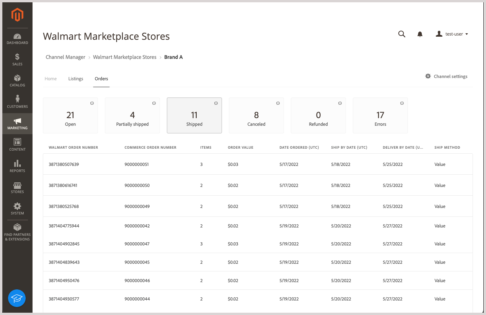

# Walmart Marketplace 주문 관리

[!DNL Walmart Marketplace] 주문 [!DNL Commerce] 제품 목록 동기화 [!DNL Channel Manager] Walmart가 주문을 처리한 후에. 동기화가 완료되면, **[!UICONTROL Orders]** 연결된 채널 저장소 보기에서 [!DNL Channel Manager].

>[!NOTE]
>
>한 번에 최대 35분이 소요될 수 있습니다 [!DNL Walmart Marketplace] 에 표시할 순서 [!DNL Channel Manager] 주문 목록. [!DNL Walmart] 수신되는 주문을 처리하고 전송하려면 약 30분이 필요합니다 [!DNL Channel Manager]. 채널 관리자가 주문을 받으면 5분 정도 더 걸려서 Adobe Commerce 또는 Magento Open Source에서 순서를 만들고 표시할 수 있습니다.

## 주문 검토

1. 관리자에서 을(를) 선택합니다. **[!UICONTROL Marketing]** > **[!UICONTROL Channel Manager]** 열다 [!UICONTROL Channel Manager Marketplace Stores] 페이지.

1. 저장소 항목 행에서 연필 아이콘을 선택하여 저장소 보기를 엽니다.

1. 주문 정보를 보려면 *를 선택합니다.[!UICONTROL *Orders]**.

1. 주문에 대한 정보를 확인하고 **[상태](#about-order-status)** 열을 사용하여 주문에 대한 정보를 얻습니다.

## 주문 세부 사항 보기

마켓플레이스에서 주문을 받고 Adobe Commerce 또는 Magento Open Source으로 가져온 후에는 [!DNL Commerce] 주문 ID를 사용하여 Adobe Commerce에서 순서를 봅니다.

From **[!UICONTROL Orders]**&#x200B;에서 을(를) 선택합니다. **[!UICONTROL Commerce Order Number]** 열다 [!DNL Commerce] 주문 세부 사항.

### 주문 통제 및 열 설명

다음 표에서는 Orders에 사용할 수 있는 컨트롤과 열을 설명합니다.

**컨트롤[!UICONTROL Orders]**
| **제어**                    | **설명**                                                                                                                                               | |—|—| | [!UICONTROL Filter orders]     | 다음 중 하나를 선택하여 보기를 정렬합니다 [!UICONTROL Order Status] 카드.                                                                                        | | 오류 메시지 세부 정보 | 마우스를 가져갑니다. [!UICONTROL Error Status] 주문 시 자세한 오류 메시지를 확인할 수 있습니다.                                                                      | | [!UICONTROL View order detail] | 주문 세부 사항을 보려면 [!DNL Commerce] 주문 번호 [!UICONTROL Order] 테이블. 그런 다음 [!DNL Commerce] 주문 옵션을 사용하여 주문을 처리합니다. |

**열 설명**

| 필드 | 설명 |
|------------------------------------|----------------------------------------------------------------------------------------------------------------------------------------------------------------------------------------------------------------------------------------------------------------------------------------------------------------------------------------------------------------------------------|
| [!UICONTROL  Walmart Order Number] | 주문에서 주문에 지정된 구매 발주 번호 [!DNL Walmart Marketplace]. 처음에 주문을 로 가져오는 경우 [!DNL Channel Manager]를 채울 때는 월마트의 주문 번호만 표시됩니다. 이 [!DNL Commerce] 주문이 생성되면 [!DNL Walmart] 주문 번호는 [!UICONTROL External ID] 제품 속성입니다. |
| [!DNL Commerce]  주문 번호 | 에 지정된 번호 [!DNL Commerce]  주문 [!DNL Walmart Marketplace] 주문. |
| 항목 | 주문된 항목 수 [!DNL Walmart Marketplace]. |
| [!UICONTROL Order Value] | 주문 품목의 총 원가. |
| [!UICONTROL Date Created] | 주문이 생성된 날짜입니다. [!DNL Walmart Marketplace]. |
| [!UICONTROL Ship By Date] | 주문을 발송해야 하는 일자 [!DNL Walmart Marketplace] 요구 사항. |
| [!UICONTROL Order Status] | 에서 현재 주문 상태를 나타냅니다. [!DNL Commerce] 주문 워크플로우입니다. 에 제품을 성공적으로 추가하면 상태가 업데이트됩니다 [!DNL Channel Manager] 및 [!DNL Walmart Marketplace]. 작업이 실패하면 목록에 오류 상태가 표시됩니다. 오류를 수정한 후 [!DNL Channel Manager] 작업을 다시 시도하고 상태를 업데이트합니다. |

| [!UICONTROL Error description]    | 를 사용하여 주문에 대한 자세한 정보를 제공합니다. *오류* 상태|

### 주문 상태 정보

[!UICONTROL Order Status] 의 현재 상태에 대한 정보를 제공합니다. [!DNL Walmart Marketplace] Adobe Commerce 또는 Magento Open Source에서 관리되는 주문. 주문 상태 업데이트는 [!DNL Channel Manager] 다음 중 하나에서 업데이트된 주문 정보를 받습니다. [!DNL Walmart Marketplace] 또는 [!DNL Commerce] 주문 시스템. 주문에는 다음 상태가 있을 수 있습니다.

* **[!UICONTROL Open]**-에서 받은 주문 [!DNL Walmart Marketplace] Adobe Commerce 또는 Magento Open Source에서 검토 및 처리할 준비가 되었습니다.

   고객이 [!DNL Walmart Marketplace]로 설정되면 연결된 채널의 주문 작업 공간에 열린 순서가 표시되는 데 최대 35분이 걸릴 수 있습니다. [!DNL Commerce] 수신되는 주문을 처리하고 전송하려면 약 30분이 필요합니다 [!DNL Channel Manager]. 채널 관리자가 주문을 받으면, 을(를) 만들고 표시하는 데 5분이 더 걸립니다 [!DNL Commerce] 주문.

* **[!UICONTROL Processed]**-출하, 취소 또는 환불 주문 [!DNL Commerce] 저장.

   출하, 취소 및 환불 주문을 모두 표시하려면 **처리됨** 상태 카드

* **[!UICONTROL Canceled]**-주문 취소 [!DNL Commerce] 저장.

   주문 취소가 완료되면 [!DNL Commerce] 반환된 품목을 반영하도록 재고 수량 업데이트. 그럼, [!DNL Channel Manager] 업데이트를에 동기화 [!DNL Walmart Marketplace].

* **[!UICONTROL Refunded]**&quot;주문에서 환불된 주문 [!DNL Commerce] 저장.

   환불이 완료되면 [!DNL Commerce] 주식 수량이 갱신되어 환급된 품목이 반영됩니다. 그럼, [!DNL Channel Manager] 업데이트를에 동기화 [!DNL Walmart Marketplace].

* **[!UICONTROL Error]**- 오류가 있는 주문. 주문 업데이트 작업이 실패할 경우 오류가 발생할 수 있습니다. 예를 들어 다음 경우 오류가 발생합니다 [!DNL Channel Manager] 월마트로부터 새 주문을 받을 수 없습니다. 이러한 매개 변수는 [!DNL Channel Manager] 주문 선적 또는 취소 갱신을 [!DNL Walmart Marketplace].

* **[!UICONTROL Error description]**-누락된 정보 또는 잘못된 값, 잘못된 납품 상세내역 또는 주문 취소 실패와 같은 문제로 인해 발생하는 주문 오류에 대한 자세한 정보를 제공합니다. 설명은 오류 발생 여부를 확인하는 데 도움이 됩니다 [!DNL Commerce] 인스턴스 또는 [!DNL Walmart Marketplace].
