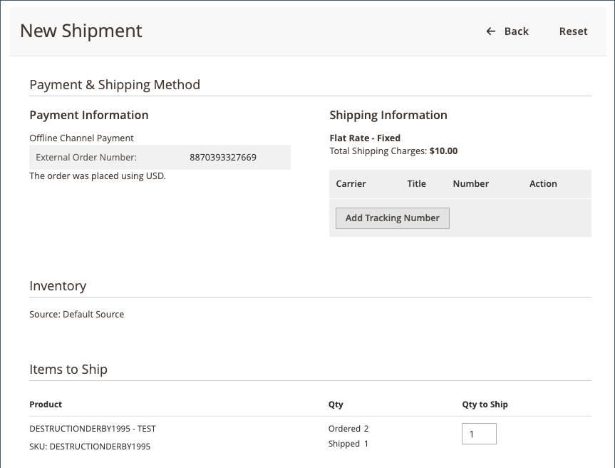

# 주문 처리

[!DNL Walmart Marketplace]개의 주문이 확인되어 [!DNL Channel Manager](으)로 전송되면 [Commerce Order Management](https://experienceleague.adobe.com/docs/commerce-admin/stores-sales/order-management/orders/orders.html#orders-workspace)을(를) 사용하여 주문을 처리합니다.

채널 관리자는 [!DNL Walmart Marketplace]에 대한 업데이트를 동기화하여 [!DNL Commerce]의 주문 상태 및 배송 정보가 [!DNL Walmart Marketplace]에서 추적된 데이터와 일치하는지 확인합니다.

* **주문 배송**-Walmart에는 모든 배송에 대한 추적 번호가 필요합니다. 일부 품목이 품절된 경우 부분 선적을 생성하여 현재 사용 가능한 품목을 발송할 수 있습니다. 배송을 제출하면 주문 업데이트가 [!DNL Walmart Marketplace]에 동기화됩니다. 그러면 월마트는 고객에게 주문 현황 및 배송 내역을 알립니다.

* **주문 취소**-주문 [!DNL Walmart Marketplace]을(를) 취소하는 경우 Walmart에서는 고객에게 보낸 주문 취소 알림에 포함된 취소 사유가 필요합니다. [!DNL Commerce] 주문 결제 정보에도 취소 이유가 표시됩니다. 취소를 제출하면 인벤토리 업데이트가 [!DNL Walmart Marketplace]에 동기화됩니다. 그러면 월마트는 고객에게 주문 현황 및 배송 내역을 알립니다.

  매점에서 전체 주문을 취소해야 합니다. [!DNL Commerce]에서 부분 취소를 허용하지 않습니다.

* **환불 요청**-배송된 주문에 대해 Walmart Marketplace 반품이 요청되면 [!UICONTROL Status details]에 반품 링크가 포함됩니다. 반환 및 환불은 [반환](return-refund-orders.md) 대시보드에서 관리됩니다.

Commerce 주문이 처리되고 [!DNL Channel Manager]에서 선적, 부분 선적 및 취소 업데이트가 [!DNL Walmart Marketplace]에 성공적으로 동기화되면 주문 처리가 완료됩니다. 배송된 주문에 대한 반품 요청 및 환불은 [반품](return-refund-orders.md) 대시보드에서 관리됩니다.

>[!NOTE]
>
> 주문 업데이트를 [!DNL Walmart Marketplace]에 동기화하는 데 최대 5분이 걸릴 수 있습니다. 주문 상태를 확인하려면 [!DNL Channel Manager] 주문 페이지로 돌아갑니다.

## 주문 배송

1. [관리자]에서 **[!UICONTROL Marketing]** > **[!UICONTROL Channel Manager]**&#x200B;을(를) 선택합니다.

1. 판매 채널 스토어의 눈 모양 아이콘을 선택하여 스토어 보기를 엽니다.

1. [!DNL Walmart Marketplace]개의 주문을 보려면 **[!UICONTROL Orders]**&#x200B;을(를) 선택하십시오.

1. Orders 테이블에서 **[!UICONTROL Commerce Order Number]**&#x200B;을(를) 선택하여 배송할 주문을 엽니다.

1. **[!UICONTROL Ship]**&#x200B;을(를) 선택하여 주문의 전체 또는 일부에 대한 배송을 만들고 제출합니다.

   [!DNL Walmart Marketplace] 주문에 대한 {width="600" zoomable="yes"}

   * 배송 회사를 선택하고 **[!UICONTROL Add tracking number]**&#x200B;을(를) 선택하여 추적 번호를 추가하십시오.

     [!DNL Walmart Marketplace] 주문에 대한 {width="600" zoomable="yes"}

   * 필요에 따라 나머지 선적 양식을 작성하십시오. 자세한 지침은 [[!DNL Shipping an Order]](https://experienceleague.adobe.com/docs/commerce-admin/stores-sales/order-management/orders/order-ship.html)을(를) 참조하십시오.

1. 배송을 제출한 후 [!DNL Channel Manager]에서 [주문 상태](manage-orders.md#about-order-status)를 추적하여 업데이트가 [!DNL Walmart Marketplace](으)로 전송되었는지 확인하십시오.

주문이 배송된 후 [!DNL Walmart Marketplace]에서 받은 반환 요청을 기반으로 주문에 포함된 항목에 대한 [!DNL Channel Manager]의 전체 또는 일부 환불을 처리할 수 있습니다. [반품 및 환불 주문](return-refund-orders.md)을 참조하세요.

## 주문 취소

1. [관리자]에서 **[!UICONTROL Marketing]** > **[!UICONTROL Channel Manager]**&#x200B;을(를) 선택합니다.

1. 판매 채널 스토어의 눈 모양 아이콘을 선택하여 스토어 보기를 엽니다.

1. [!DNL Walmart Marketplace]개 주문을 보려면 *[!UICONTROL Orders]**을(를) 선택하십시오.

1. Orders 테이블에서 취소할 주문에 대해 **[!UICONTROL Commerce Order Number]**&#x200B;을(를) 선택하여 [주문 세부 정보 페이지](manage-orders.md#view-order-detail)를 엽니다.

   ![a[!DNL Walmart Marketplace]order](assets/order-detail-with-external-order-id.png){width="600" zoomable="yes"}에 대한 Commerce 주문 세부 사항 보기

1. 주문을 취소합니다.

   * [주문 세부 사항] 메뉴에서 **취소**&#x200B;를 선택합니다.

   * [!UICONTROL Cancel Order] 양식에서 **[!UICONTROL Cancellation reason]**&#x200B;을(를) 선택합니다.

   [!DNL Walmart Marketplace] 주문에 대한 {width="600" zoomable="yes"}

   * **[!UICONTROL Cancel Order]**&#x200B;을(를) 선택합니다.

1. 취소를 제출한 후 [!DNL Channel Manager]에서 [주문 상태](manage-orders.md#about-order-status)를 추적하여 업데이트가 [!DNL Walmart Marketplace](으)로 전송되었는지 확인하십시오.

## 주문 오류 수정

[!DNL Walmart Marketplace]의 주문 동기화 프로세스 또는 선적, 부분 선적 및 취소에 대한 주문 업데이트 프로세스 중에 오류가 발생할 수 있습니다.

배송, 부분 배송 또는 취소 업데이트에 대한 동기화 작업이 실패하면 [!DNL Channel Manager] 주문 페이지에 해당 주문에 대한 _오류_ 상태가 표시됩니다. 배송 정보와 주문 취소 정보가 Walmart Marketplace 계정에 정확하게 반영되도록 하려면 [!DNL Walmart Marketplace] 스토어에서 주문을 수동으로 업데이트하십시오.

