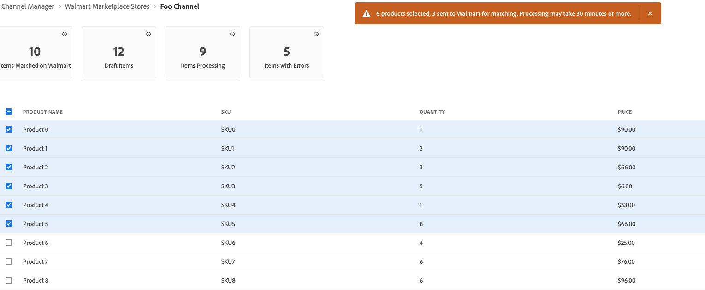

# Walmart에 목록 게시

다른 시장들과 마찬가지로, 월마트는 서드파티 판매자들이 다른 사람들이 파는 품목들을 나열하도록 허락한다.

플랫폼은 UPC 및 GTIN과 같은 제품 식별자를 사용하여 이미 판매 중인 항목을 일치시킵니다.
일치하는 제품의 경우 기존 Walmart Marketplace에서 Commerce 제품에 대한 오퍼를 포함하도록 업데이트를 나열합니다.
일반적으로 가격이 가장 낮은 제품이 결과에 먼저 나타납니다. 하지만 리뷰 같은 다른 요소들은 또한 배치에도 영향을 미친다.

## 일치 워크플로우

제품에 일치하면 Channel Manager는 제품 데이터를 Walmart Marketplace에 보내 매핑된 Commerce 제품 속성과 일치하는 속성 값으로 기존 목록을 검색합니다.

일치하는 항목이 있으면 기존 제품 목록이 업데이트되어 오퍼를 추가합니다.

## 전제 조건

제품에 일치하기 전에 제품 카탈로그 속성 값이 Mart 요구 사항을 충족하는지 확인하고 속성 설정을 구성합니다. 자세한 내용은 [제품 일치 구성](map-product-attributes-for-matching.md)

## 제품 선택 및 일치

1. 연결된 영업 채널을 엽니다.

1. From **[!UICONTROL Listings]**&#x200B;에 일치하는 제품을 선택합니다. *[!UICONTROL Draft]* 상태.

   

1. 선택 **[!UICONTROL Match Products]**.

   메시지를 통해 일치를 위해 전송된 제품 수를 나타냅니다.

   

   Walmart Marketplace에서 일치 작업을 완료하는 데 최대 30분이 걸릴 수 있습니다.

   선택한 제품의 상태가 *[!UICONTROL Processing]* 일치 작업이 완료될 때까지. Walmart Marketplace에서 일치 작업을 완료하는 데 최대 30분이 걸릴 수 있습니다.

## 일치 상태 확인

1. 선택 **제품 새로 고침** 최신 제품 상태를 업데이트하려면

1. 제품 상태를 확인합니다.

   일치가 완료되면 상태를 확인할 수 있습니다 *일치* 또는 *오류*.

   * **[!UICONTROL Match]** 제품이 일치했음을 나타냅니다. 제품 오퍼가 기존 Walmart Marketplace 목록에 게시되었습니다.

   * **[!UICONTROL Error]** 다음 중 하나를 나타냅니다.

      * 오류가 발생하여 일치 작업이 실패했습니다.

      * 일치하는 항목이 없습니다.

      * 일치하는 항목이 있지만 [마켓플레이스 저장소가 활성 상태가 아닙니다.](walmart-prerequisites.md#walmart-marketplace-store-status).

## 제품 일치 오류 문제 해결

제품 일치 작업이 실패하면 Walmart Marketplace에서 오류 코드를 반환하고 Channel Manager가 제품 목록 정보에 오류 상태를 표시합니다.

마우스로 를 가리키면 오류 메시지 세부 정보를 볼 수 있습니다. **오류** 상태 레이블입니다. 반환된 일반적인 오류는 올바른 형식의 제품 ID 값이나 필수 속성이 누락되었습니다.

## 제품 ID 값 수정

| 유형 | 설명 | 예 |
|------|------------------------------------------------------------------------------------------------------------------------------------------------------------------------------------|---------------------------------------------|
| UPC | GTIN-12, 12자리 숫자(확인 자리 포함).  UPC의 자릿수가 8자리인 UPC-E와 같이 12자리 미만이면 을 추가합니다. 요구 사항을 충족하도록 0을 표시합니다. | 변경 대상 `45678912345` to `045678912345` |
| GTIN | GTIN-14, 14자리 숫자(확인 숫자 포함).  GTIN에 14자리 미만의 숫자가 있는 경우 앞에 0을 추가합니다  요구 사항을 충족하기 위해 | 변경 `456789123456` to `0045678912345` |
| EAN | GTIN-13, 13자리 숫자(확인 숫자 포함).  EAN에 13자리 미만의 숫자가 있는 경우 선행 값을 추가합니다 요구 사항을 충족하기 위해 0을 사용합니다. | 변경 대상 `4567891234` to `0004567891234` |

Walmart Marketplace 오류 코드에 대한 자세한 내용은 [Walmart Seller 도움말](https://sellerhelp.walmart.com/s/guide?article=000005844).
