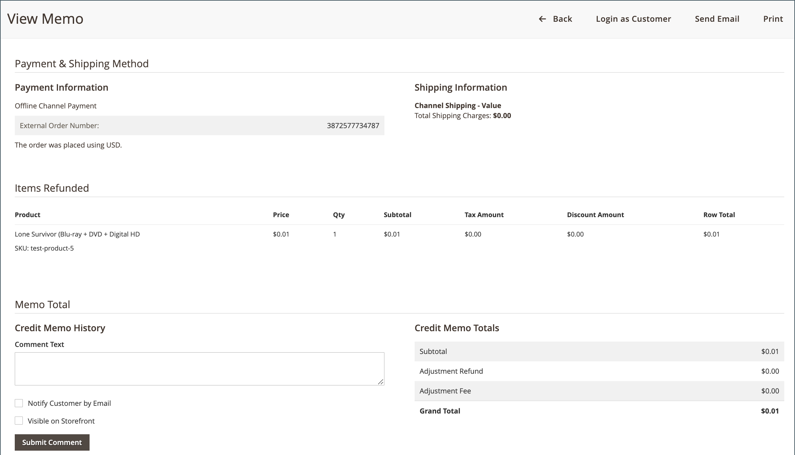

# 반품 및 환불 주문

구매자가 [!DNL Walmart Marketplace]을(를) 통해 구매한 주문 항목에 대한 반품을 요청하면 Walmart에서 반품 요청을 만듭니다. [!DNL Channel Manager]은(는) 이러한 요청에 대해 마켓플레이스 채널을 모니터링하고 반환 요청 정보를 채널 관리자에 자동으로 동기화합니다.

Commerce 측에서 반환 요청은 다음 워크플로우를 시작합니다.

1. 채널 관리자는 수신된 상태의 해당 반환 요청을 만들고 반환 ID 번호([!UICONTROL RMA #])를 [!UICONTROL Returns] 대시보드에 추가합니다. [!DNL Orders] 대시보드에서 반환 관련 주문의 상태 세부 정보에 [!UICONTROL Return requested] 링크가 포함되어 반환을 보고 처리할 수 있습니다.

1. 가맹점은 [Adobe Commerce 환불 워크플로우](https://experienceleague.adobe.com/docs/commerce-admin/stores-sales/order-management/credit-memos/credit-memos.html)에 따라 대변 메모를 만들어 반품과 관련된 환불을 처리합니다. 모든 환불은 오프라인 방식으로 진행됩니다.

1. [!DNL Channel Manager]이(가) Adobe Commerce의 환불 완료를 반영하도록 반환 상태를 업데이트할 수 있도록 Walmart 마켓플레이스에 환불 업데이트를 보냅니다.

Storefront 관리자는 판매 채널 스토어를 열고 **[!UICONTROL Returns]**&#x200B;을(를) 선택하여 채널 관리자에서 반품을 보고 처리할 수 있습니다.

![채널 관리자가 [!DNL Walmart Marketplace]](assets/returns-dashboard-view.png){width="600" zoomable="yes"}에서 받은 반환 요청에 대한 환불을 처리하기 위해 대시보드를 반환합니다.

>[!NOTE]
>
>출하된 주문에 대한 환불만 처리할 수 있습니다. [!DNL Channel Manager]에서 주문 상태는 [!UICONTROL Shipped]이어야 합니다. [!DNL Walmart Marketplace] 판매자 계정에서 주문은 [!UICONTROL Delivered]이어야 합니다.

## 컨트롤 및 열 설명 반환

다음 표에서는 [!DNL Channel Manager] 반환에 사용할 수 있는 컨트롤과 열을 설명합니다.

[!UICONTROL Returns]**에 대한**&#x200B;컨트롤

<table>
<tr>
<td><strong>제어</strong></td>
<td><strong>설명</strong></td>
</tr>
<tr>
<td>[!UICONTROL Filter returns]</td>
<td>[!UICONTROL Return Status]개 카드 중 하나를 선택하여 보기를 필터링합니다.</td>
</tr>
<tr>
<td>상태 세부 정보</td>
<td>[!UICONTROL Received] 또는 [!UICONTROL Refunded] 상태의 반환 항목의 경우 상태 세부 정보 열에서 연결된 텍스트를 선택하여 환불에 대한 대변 메모를 만들거나 볼 수 있습니다.</td>
</tr>
<tr>
<td>[!UICONTROL View order detail]</td>
<td>주문 세부 사항을 보려면 [!UICONTROL Order] 테이블에서 [!DNL Commerce] 주문 번호를 선택하여 Commerce 주문을 엽니다.</td>
</tr>
<tr>
<td>[!UICONTROL Channel Settings]</td>
<td>채널 구성을 수정하려면 채널 Walmart 연결 자격 증명, 매핑된 특성 또는 배송 식별자를 선택하고, 설정은 [!UICONTROL Order] 테이블에서 [!DNL Commerce] 주문 번호를 선택합니다. 그런 다음 [!DNL Commerce] 순서 옵션을 사용하여 순서를 처리합니다.</td>
</tr>
</table>

**열 설명**

<table>
<tr>
<td><strong>필드</strong></td>
<td><strong>설명</strong></td>
</tr>
<tr>
<td>[!UICONTROL RMA #]</td>
<td>[!DNL Walmart Marketplace]에서 받은 반환 요청과 연결된 반환 제품 인증 번호입니다. 반환 프로세스가 시작되면 Walmart Marketplace [!UICONTROL Returns]에서 이 숫자를 생성합니다.</td>
</tr>
<tr>
<td>[!DNL Commerce] 주문 번호</td>
<td>Walmart Marketplace의 반환 요청에 포함된 항목과 연결된 [!DNL Commerce] 주문 번호입니다. 주문 번호를 선택하여 주문 세부 사항을 조회합니다.</td>
</tr>
<tr>
<td>요청됨</td>
<td>[!DNL Walmart Marketplace]에 반환을 요청한 날짜
현지 시간으로 변환되었습니다.</td>
</tr>
<tr>
<td>[!UICONTROL Return By]</td>
<td>현지 시간으로 환산된 [!DNL Walmart Marketplace][requirements](https://sellerhelp.walmart.com/seller/s/guide?language=en_US&amp;article=000007176f)을(를) 충족하기 위해 반환해야 하는 날짜입니다.</td>
</tr>
<tr>
<td>[!UICONTROL Items]</td>
<td>반품에 나열된 각 항목에 대한 SKU 및 수량을 나열합니다.</td>
</tr>
<tr>
<td>[!UICONTROL Refund amount]</td>
<td>반환된 항목에 대해 반환할 총 값입니다.</td>
</tr>
<tr>
<td>[!UICONTROL Status]</td>
<td>[!DNL Commerce] 반환 워크플로우의 현재 반환 상태를 나타냅니다-<i>받음</i>, <i>환불됨</i> 또는 <i>오류</i>.</td>
</tr>
<tr>
<td>[!UICONTROL Status Details]</td>
<td>입고 및 환불 반품 항목의 경우 상태 상세내역은 환불 처리를 위해 대변 메모에 액세스할 수 있는 링크를 제공합니다. Adobe Commerce과 [!DNL Walmart marketplace] 간의 [!DNL Channel Manager] 동기화 프로세스 중에 오류가 발생하면 이 필드에 오류 설명이 표시됩니다.</td>
</tr>
</table>

## 반환 상태

[!UICONTROL Return Status]은(는) Adobe Commerce 또는 Magento Open Source에서 관리되는 [!DNL Walmart Marketplace] 반환 요청의 현재 상태에 대한 정보를 제공합니다.

반환 상태 업데이트는 [!DNL Channel Manager]이(가) [!DNL Walmart Marketplace]에서 반환 요청을 받거나 반환된 항목에 대한 환불을 처리하기 위해 [!DNL Commerce] 신용 메모를 만들 때 발생합니다.

반품은 다음과 같은 상태를 가질 수 있습니다.

* **[!UICONTROL Received]**-[!DNL Walmart Marketplace] 저장소에서 받은 반환 요청의 초기 상태입니다. 판매자는 [!UICONTROL Status details]에서 **[!UICONTROL Create credit memo]**&#x200B;을(를) 선택하여 반품에 대한 환불을 처리할 수 있습니다.

* **[!UICONTROL Refunded]** - 반환된 항목에 대한 환불을 발행하기 위해 대변 메모가 생성되었음을 나타냅니다. 가맹점은 [!UICONTROL Status details]에서 **[!UICONTROL View credit memo]**&#x200B;을(를) 선택하여 환불 정보를 볼 수 있습니다.

* **[!UICONTROL Error]** - 오류가 있는 요청을 반환합니다. Walmart의 반환 요청에 누락되거나 잘못된 데이터가 있을 때 오류가 발생할 수 있습니다. 또는 [!DNL Channel Manager]에서 환불 업데이트 알림을 Walmart로 보낼 수 없는 경우

## 재방문 시나리오

다음 시나리오에서는 [!DNL Channel Manager]의 다양한 반환 요청 유형에 대해 환불을 발급하는 방법을 설명합니다.

* **전체 반환**—Walmart Marketplace 반환 요청이 주문의 모든 항목에 대한 요청인 경우, 모든 항목을 환불하려면 대변 메모 수량을 업데이트하십시오.

* **부분 반환**-Walmart Marketplace 반환 요청이 일부 주문 항목에만 해당하는 경우 환불할 항목에 대해서만 대변 메모 수량을 업데이트하십시오.

* **이미 Walmart Marketplace를 통해 환불된 반환**-경우에 따라 Channel Manager에서 반품을 처리하기 전에 [!DNL Walmart Marketplace]에 환불됩니다. 예를 들어 월마트에서 요구하는 48시간 환불 처리 기간 내에 Commerce 주문이 환불되지 않으면 월마트가 자동으로 주문을 환불한다. 이 경우 Channel Manager는 반환 요청을 Adobe Commerce에 동기화하므로 반환을 처리하고 대변 메모를 발행할 수 있습니다. 이 워크플로우에서는 [!DNL Commerce]의 주문 세부 정보가 Walmart Marketplace의 주문 정보와 일치하는지 확인합니다.

>[!NOTE]
>
> 환불 업데이트가 [!DNL Walmart Marketplace]에 동기화되는 데 최대 5분이 걸릴 수 있습니다. [!DNL Channel Manager] [!UICONTROL Returns] 대시보드에서 현재 반환 상태를 확인할 수 있습니다.

## 환불 요청 처리

1. 판매 채널 스토어의 [!UICONTROL Returns] 대시보드를 엽니다.

   * [관리자]에서 **[!UICONTROL Marketing]** > **[!UICONTROL Channel Manager]**&#x200B;을(를) 선택합니다.

   * 판매 채널 스토어의 눈 모양 아이콘을 선택하여 스토어 보기를 엽니다.

   * **[!UICONTROL Returns]** 탭을 선택하여 결과를 검토할 수 있습니다.

     [!UICONTROL Orders] 페이지에서 반환 정보에 액세스할 수도 있습니다. 반환 요청이 있는 [!UICONTROL Shipped]개 주문을 찾습니다. 그런 다음 [!UICONTROL Status Details] 열에서 `Return requested` 링크를 선택하여 요청을 보고 처리합니다.

1. 반환 테이블에서 *[!UICONTROL Received]* 상태의 반환을 찾습니다.

1. 품목 열에서 환불 주문 품목 및 수량 목록을 검토합니다.

1. 대변 메모를 발행하여 환불을 처리합니다.

   * [!UICONTROL Status Details] 열에서 **[!UICONTROL Create credit memo]**&#x200B;을(를) 선택하여 [!DNL Commerce]에서 주문 세부 사항 페이지를 엽니다.

     주문이 송장 발행되지 않은 경우 주문 세부 사항 페이지에 주문 세부 사항을 생성하라는 오류 메시지가 표시됩니다. **[!UICONTROL Create invoice]**&#x200B;을(를) 선택합니다. 그런 다음 [송장을 만들고 저장](https://experienceleague.adobe.com/docs/commerce-admin/stores-sales/order-management/invoices.html)하세요.

   * 주문 세부 정보 페이지에서 **[!UICONTROL Credit Memo]**&#x200B;을(를) 선택합니다.

   * [!UICONTROL Credit Memo]의 [!UICONTROL Items to Refund] 섹션에서 반환 요청에 포함된 항목에 대한 **[!UICONTROL Qty to refund]** 및 **[!UICONTROL Return to Stock]** 정보를 업데이트하십시오.

     반환 요청에 나열된 항목만 반환해야 합니다.

   * 댓글을 추가하려면 **[!UICONTROL Credit Memo Comments]**&#x200B;에 텍스트를 입력하십시오.

   * **[!UICONTROL Refund Offline]**&#x200B;을(를) 선택합니다.

환불을 완료한 후 [!DNL Channel Manager]은(는) [!UICONTROL Returns] 대시보드의 반환 상태를 [!UICONTROL Refunded](으)로 업데이트하고 업데이트를 월마트에 동기화하여 마켓플레이스에서 반환 상태를 업데이트합니다.

## 반품에 대한 환불 정보 보기

[!UICONTROL Returns] 대시보드에서 반환 요청 및 환불 처리에 대한 정보를 볼 수 있습니다.

1. 판매 채널 스토어에 대한 반환 대시보드를 엽니다.

   * [관리자]에서 **[!UICONTROL Marketing]** > **[!UICONTROL Channel Manager]**&#x200B;을(를) 선택합니다.

   * 판매 채널 스토어의 눈 모양 아이콘을 선택하여 스토어 보기를 엽니다.

   * **[!UICONTROL Returns]**&#x200B;을(를) 선택합니다.

1. **[!UICONTROL Refunded]** 상태 카드를 선택하여 환불 주문을 봅니다.

1. **[!UICONTROL View credit memo]**&#x200B;을(를) 선택하여 반품에 대한 환불 세부 정보를 봅니다.

   [!DNL Walmart Marketplace] 주문에 대해 반품된 항목을 환불하기 위한 {width="600" zoomable="yes"}

>[!NOTE]
>
>주문이 환불된 후 [!UICONTROL Orders] 대시보드에 반환 정보가 표시되지 않습니다. 반환 정보를 보려면 [!DNL Channel Manager] 반환 대시보드를 사용하십시오. 자세한 반품 및 환불 정보는 주문 상세 페이지에서도 확인할 수 있습니다.

## 반환 오류 수정

[!DNL Walmart Marketplace]에서 반환 정보를 받거나 [!DNL Channel Manager]에서 [!DNL Commerce]에서 [!DNL Walmart Marketplace](으)로 상태 업데이트를 동기화할 때 오류가 발생할 수 있습니다.

반환 업데이트에 대한 동기화 작업이 실패하면 [!DNL Channel Manager] 반환 대시보드에 반환 항목에 대한 *[!UICONTROL Error]* 상태가 표시됩니다. 반환 및 환불 정보가 Walmart Marketplace 계정에 정확하게 반영되도록 하려면 [!DNL Walmart Marketplace] 스토어에서 주문을 수동으로 업데이트하십시오.
